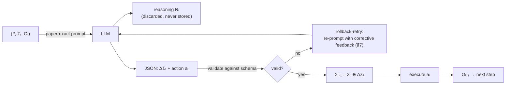

<div align="center">

# skillstate

**O(1) prompt-footprint runtime for long-horizon agent skills — structured execution state instead of append-only conversation history.**

[](./CONTRIBUTING.md)
[](#development)
[](https://www.npmjs.com/package/skillstate)
[](https://www.npmjs.com/package/skillstate)
[](./LICENSE)

</div>

---

Agent skills today run on an **append-only conversation history**: every step re-sends the entire transcript, so token cost grows quadratically — **O(T²)** cumulative for a T-step task. Long histories also *poison* the agent: stale hypotheses, dead ends, and raw tool spam crowd out the instructions, and accuracy degrades as the context fills.

`skillstate` implements the **SKILL.state** runtime from the paper [*SKILL.state: Scalable Long-Horizon Agent Skills*](https://arxiv.org/abs/2608.26263) (arXiv:2608.26263). Instead of replaying history, the agent maintains a compact, structured **execution state Σₜ** — a fixed-schema JSON object that is read once per step and patched between steps. The prompt footprint stays **O(1)** per step (a flat ~1.8k chars regardless of progress — Table 1 reports ~1800 characters, not tokens), cumulative cost drops to **O(T)**, and the agent always sees exactly what it knows.

## Results reported by the paper

| Metric | Conversation baseline | SKILL.state |
| --- | --- | --- |
| Cumulative prompt chars, Warehouse Gemini-3-Flash T=100 vs Stateful (1062387 vs 65408, §5.2) | O(T²) | **16.2× lower (paper-reported, not re-measured)** |
| Prompt size per step | grows with history | **flat ~1.8k chars (Table 1, not tokens)** |
| Worst baseline at max T: cumulative chars, T=200 Memory vs SKILL (6175509 vs 122384, Table 1) | O(T²) | **~50× (derived from Table 1 cells — worst baseline at max T, not a paper claim; "50x" appears nowhere in the text)** |
| pass@1, InterCode CTF benchmark | 43.2% | **54.2%** |

CTF/τ-Bench save only −60%/−40% — the large multiples come from the long-horizon Warehousing runs, not from every benchmark. Numbers are as reported in the paper, not re-measured by this implementation.

> Fidelity notes (exact): "~1.8k chars Table 1 not tokens"; "16.2x Warehouse Gemini-3-Flash T=100 vs Stateful 1062387 vs 65408 §5.2 paper-reported not re-measured"; "до ~50x vs Memory на T=200 6175509 vs 122384 Table 1 — худший baseline на max T, не claim пейпера; CTF/τ-Bench −60%/−40%"; "§5.7/§7/A.4 как упрощенная имплементация, адаптеры non-paper/additive без очистки истории хостом экономии нет."

## How it works



Each step:

1. Format the prompt `(P, Σₜ, Oₜ)` — procedural spec P, current state Σₜ, latest observation Oₜ. Nothing else.
2. The LLM returns free-text reasoning **Rₜ** followed by a fenced JSON block with exactly two keys: `state_patch` (ΔΣₜ) and `action` (aₜ).
3. **Rₜ is returned to the caller but never stored** — it cannot poison the next prompt.
4. ΔΣₜ is validated against the spec's schema. On failure, the runtime re-prompts with corrective feedback (the §7 rollback-retry cycle). After exhausting retries, the step fails deterministically: state is untouched, the sentinel action `__invalid_patch__` is reported.
5. On success the patch is merged: **Σₜ₊₁ = Σₜ ⊕ ΔΣₜ** — null values *delete* keys, nested objects merge recursively, the original state is never mutated (rollback is free).
6. The action is executed against the environment, producing Oₜ₊₁.

## Installation

```bash
npm install skillstate
```

Requires Node.js >= 20. TypeScript types are bundled.

## Quick start

```ts
import { SkillStateRuntime, TokenTracker } from 'skillstate/core';
import { INTERCODE_CTF_SPEC } from 'skillstate/schemas';
import type { Observation } from 'skillstate/core';

const tracker = new TokenTracker({
  platform: 'generic',          // required: 'claude' | 'opencode' | 'generic'
  sessionName: 'ctf-run-1',
});

const runtime = new SkillStateRuntime({
  spec: INTERCODE_CTF_SPEC,     // canonical 5-field CTF spec (paper §3.1)
  llm: async (prompt) => {
    // Your LLM call. The prompt asks for reasoning + a fenced JSON block
    // with exactly two keys: state_patch and action.
    return callYourLLM(prompt);
  },
  execute: async (action, state): Promise<Observation> => {
    // Run the action (e.g. a bash command in a container) and return
    // what the agent observes next.
    const output = await runCommand(action);
    return {
      content: output,
      timestamp: Date.now(),
      source: 'bash',
    };
  },
  tracker,                      // optional; records per-step token metrics
  maxValidationRetries: 2,      // optional; default 2 (max attempts = 3)
});

// One Algorithm 1 step:
const step = await runtime.step({
  content: 'ls -la /',
  timestamp: Date.now(),
  source: 'bash',
});
console.log(step.action);            // the executed action
console.log(runtime.state);          // Σₜ₊₁ (read-only copy)
console.log(step.reasoning);         // returned to you, never stored in state

// Or run until done (default maxSteps: 100):
const results = await runtime.run(
  { content: 'Initial observation', timestamp: Date.now() },
  (r) => (r.newState.discovered_flags as string[]).length > 0,
);

// Metrics (§4.3):
console.log(tracker.getMetrics().averagePromptSize);  // flat — that's the point
console.log(tracker.compareWithBaseline().reductionFactor);
tracker.save('./skillstate-report.json');             // full JSON report
```

A plausible `llm` response looks like:

````text
I should check for hidden files in /home first.

```json
{
  "state_patch": {
    "working_dir": "/home",
    "active_files": [".bash_history"],
    "cmd_summary": "listed /home, found .bash_history",
    "tested_hypotheses": ["ls -la /"]
  },
  "action": "cat /home/.bash_history"
}
```
````

## Core concepts

| Concept | Symbol | What it is |
| --- | --- | --- |
| **ProceduralSpec** | `P` | Immutable skill definition: `id`, `name`, `instructions`, `schema`, `version`. The schema declares valid state keys, their types, and defaults. |
| **SkillState** | `Σₜ` | The mutable execution state — a plain JSON object whose keys are constrained by the schema. This is *all* the agent remembers between steps. |
| **Observation** | `Oₜ` | Latest environment observation: `{ content, timestamp, source? }`. |
| **StatePatch** | `ΔΣₜ` | The sparse update the LLM emits each step. Values overwrite; **`null` deletes a key**; nested objects merge recursively. |
| **⊕ merge** | `Σₜ₊₁ = Σₜ ⊕ ΔΣₜ` | Null-deletion merge (`StateManager.mergeState`). Never mutates the input state — merged states are fresh objects. |
| **Reasoning discard** | `Rₜ` | Everything before the JSON fence. Returned in `StepResult.reasoning` for debugging, but never persisted into Σₜ. |

Standalone state utilities are also exported: `StateManager.createInitialState`, `StateManager.mergeState`, `StateManager.validatePatch`, `StateManager.serializeState`, `StateManager.deserializeState` (plus a `createStateManager()` factory with the same functions).

## Platform integrations

### Claude Code

```ts
import { ClaudeAdapter } from 'skillstate/claude';
import { INTERCODE_CTF_SPEC } from 'skillstate/schemas';

const adapter = new ClaudeAdapter();

// System-prompt boilerplate that turns any Claude Code session into
// state-based execution mode:
const modePrompt = adapter.generateAppendPrompt();

// Lifecycle hooks (self-contained CommonJS scripts, run via `node script.cjs`):
const pre = adapter.generateHookScript('PreToolUse', './.skillstate.json');
// -> injects the persisted state into the tool call's additionalContext

const post = adapter.generateHookScript(
  'PostToolUse',
  './.skillstate.json',
  INTERCODE_CTF_SPEC.schema,
);
// -> extracts state_patch from the response, validates it against the
//    embedded schema, applies the null-deletion merge, saves the state file

// Also available: adapter.injectState(state, spec), adapter.formatPrompt(state, observation, spec),
// adapter.extractPatch(response), adapter.extractAction(response)
```

### opencode

```ts
import { OpenCodeAdapter } from 'skillstate/opencode';

const adapter = new OpenCodeAdapter();

// SKILL.md with frontmatter (name/description/version + execution_context
// pointing at the persisted state file) and the state-based process body:
const skillMd = adapter.generateSkillMd(INTERCODE_CTF_SPEC, './.skillstate.json');

// Plugin that hooks tool.execute.before, reads the persisted state, and
// injects it into every tool call:
const plugin = adapter.generatePluginCode('./.skillstate.json');

// Also available: adapter.injectState(state, spec), adapter.formatPrompt(state, observation, spec),
// adapter.extractPatch(response), adapter.extractAction(response)
```

## Metrics

`TokenTracker` implements exactly the paper's §4.3 methodology — three metrics, measured in raw string chars (never tokenizer output, never a len/4 estimate):

```ts
const tracker = new TokenTracker({ platform: 'claude', sessionName: 'eval' });

// After steps have been recorded (automatically when passed to a runtime):
const metrics = tracker.getMetrics();
metrics.totalChars;           // Total Token Cost (§4.3): cumulative char burn (prompts + responses)
metrics.totalPromptChars;     // cumulative prompt chars
metrics.stepCount;
metrics.averagePromptSize;    // Average Prompt Size (§4.3): mean prompt char length per call — flat, that's the point
metrics.accuracy;             // Task Accuracy (§4.3): accepted patches / actionable
                              // steps; null when no step was actionable

const baseline = tracker.compareWithBaseline();  // Table 1 methodology on measured chars
baseline.conversationChars;   // Σₜ Σᵢ promptChars[i] — the O(T²) conversation model
baseline.stateChars;          // Σₜ promptChars[t] — the O(T) state model
baseline.reductionFactor;     // conversationChars / stateChars

tracker.exportReport();       // full JSON report (metrics + steps + session)
tracker.save('./report.json');// persist; tracker.load() restores
```

The tracker models the conversation baseline exactly: at step *t* the transcript re-sends every prior turn, so cumulative conversation chars are `Σ(t=1..T) Σ(i=1..t) promptChars[i]`, while the state runtime sends only the current Σₜ each time. For constant-size prompts the closed form is `reductionFactor = (T+1)/2` (paper §3.3 eq.5–7).

Need a rough dollar figure or a tokenizer heuristic? Those are NOT paper metrics — use the explicitly-marked `@non-paper` helpers in `skillstate/core` (`instrumentation`: `CharDiv4Counter`, `estimateCostSavings`) and label the result as estimated.

## Package exports

| Path | Contents |
| --- | --- |
| `skillstate` | Everything (core + adapters + schemas) |
| `skillstate/core` | `SkillStateRuntime`, `TokenTracker`, `StateManager`, `PromptTransformer`, `instrumentation` (@non-paper estimates), all types |
| `skillstate/claude` | `ClaudeAdapter` |
| `skillstate/opencode` | `OpenCodeAdapter` |
| `skillstate/schemas` | `INTERCODE_CTF_SPEC` |

## Paper fidelity

- [x] Algorithm 1 loop — prompt `(P, Σₜ, Oₜ)` → LLM → validate ΔΣₜ → merge ⊕ → execute aₜ. The model never receives previous observations, actions, or reasoning (§3); Rₜ is discarded permanently (§3.2)
- [x] ⊕ null-deletion merge (nested-object aware, non-mutating)
- [x] Appendix A.4 verbatim paper prompt format (`PromptTransformer.formatPaper`) — simplified implementation of the A.4 skeleton (Instructions / Skill Execution State ```json compact / Latest Observation / reasoning-will-be-discarded + two-key JSON fence); all other formatters (`formatForClaude`, `formatForOpenCode`, generic) are `@non-paper` adapter conveniences
- [x] §7 rollback-retry cycle with corrective feedback; deterministic fallback after retries — simplified (fixed retry count); malformed outputs never touch state per the Limitations paragraph
- [x] §5.7 failure-mode taxonomy is paper log analysis (68% Premature Overwrite/Deletion, 20% Schema/Type Coercion, 12% JSON Syntax on Gemma-4-31B T=100 logs) — NOT parser codes. Our parse-failure reasons (`no_block`, `malformed_json`, `missing_state_patch`, `missing_action`) are implementation-internal (`@non-paper`) and only feed the §7 retry feedback
- [x] O(1)/O(T) property test — prompt size stays constant modulo observation growth (`tests/core/runtime-footprint.test.ts`)
- [x] InterCode CTF canonical 5-field schema (`discovered_flags`, `tested_hypotheses`, `active_files`, `working_dir`, `cmd_summary`)
- [x] All three §4.3 metrics in chars — Task Accuracy, Average Prompt Size (mean chars), Total Token Cost (cumulative burn) (`TokenTracker`); Table 1 ratios pinned as fixtures (`tests/core/paper-fidelity.test.ts`)
- [ ] Claude/OpenCode adapters are `@non-paper` (no adapters in the paper) and ADDITIVE: they inject state on top of host history without trimming it, so alone they yield no economy — the saving needs the host to stop re-sending history

## Development

```bash
npm install
npm test                # 306 tests
npm run test:coverage   # 100% thresholds enforced (branches/functions/lines/statements)
npm run typecheck       # tsc --noEmit
npm run build           # emit dist/
```

The library is developed test-first: every behavior lands with a failing test before its implementation (see [CONTRIBUTING.md](./CONTRIBUTING.md)).

## Citation

If you use skillstate, please cite the paper:

```bibtex
@article{badhe2026skillstate,
  title   = {SKILL.state: Scalable Long-Horizon Agent Skills},
  author  = {Badhe, Sanket and Tiwari, Priyanka and Chung, Jonghyun},
  journal = {arXiv preprint arXiv:2608.26263},
  year    = {2026},
  url     = {https://arxiv.org/abs/2608.26263}
}
```

## License

[MIT](./LICENSE) © 2026 Vitaly Kuzyaev
