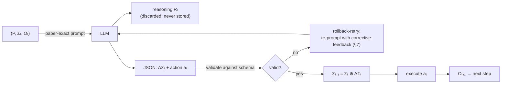

<div align="center">

# skillstate

**O(1) prompt-footprint runtime for long-horizon agent skills — structured execution state instead of append-only conversation history.**

[](./CONTRIBUTING.md)
[](#development)
[](https://www.npmjs.com/package/@skillstate/core)
[](https://www.npmjs.com/package/@skillstate/core)
[](./LICENSE)

</div>

---

Agent skills today run on an **append-only conversation history**: every step re-sends the entire transcript, so token cost grows quadratically — **O(T²)** cumulative for a T-step task. Long histories also *poison* the agent: stale hypotheses, dead ends, and raw tool spam crowd out the instructions, and accuracy degrades as the context fills.

`skillstate` implements the **SKILL.state** runtime from the paper [*SKILL.state: Scalable Long-Horizon Agent Skills*](https://arxiv.org/abs/2608.26263) (arXiv:2608.26263). Instead of replaying history, the agent maintains a compact, structured **execution state Σₜ** — a fixed-schema JSON object that is read once per step and patched between steps. The prompt footprint stays **O(1)** per step (a flat ~1.8k chars regardless of progress — Table 1 reports ~1800 characters, not tokens), cumulative cost drops to **O(T)**, and the agent always sees exactly what it knows.

## Results reported by the paper

| Metric | Conversation baseline | SKILL.state |
| --- | --- | --- |
| Cumulative prompt chars, Warehouse Gemini-3-Flash T=100 vs Stateful (1062387 vs 65408, §5.2) | O(T²) | **16.2× lower (paper-reported, not re-measured)** |
| Prompt size per step | grows with history | **flat ~1.8k chars (Table 1, not tokens)** |
| Worst baseline at max T: cumulative chars, T=200 Memory vs SKILL (6175509 vs 122384, Table 1) | O(T²) | **~50× (derived from Table 1 cells — worst baseline at max T, not a paper claim; "50x" appears nowhere in the text)** |
| pass@1, InterCode CTF benchmark | 43.2% | **54.2%** |

CTF/τ-Bench save only −60%/−40% — the large multiples come from the long-horizon Warehousing runs, not from every benchmark. Numbers are as reported in the paper, not re-measured by this implementation.

## Our measurements (reproducible, `npm run bench`)

Local deterministic harness (`packages/bench/src/harness.ts`): fixed 593-char
`formatPaper` turns, fixed 64-char observations, fixed mock-LLM replies —
no Gemini, no warehouse. Conversation baseline = prefix sums of our own
state prompts (the `TokenTracker.compareWithBaseline` model, paper §3.3
eq.5), so the reduction is exactly `(T+1)/2` — an optimistic upper bound,
not a deployment claim:

| T | state cumulative (chars) | conv cumulative (chars) | reduction (ours) | formula (T+1)/2 |
| --- | --- | --- | --- | --- |
| 10 | 5930 | 32615 | **5.5x** | 5.5 |
| 50 | 29650 | 756075 | **25.5x** | 25.5 |
| 100 | 59300 | 2994650 | **50.5x** | 50.5 |
| 200 | 118600 | 11919300 | **100.5x** | 100.5 |

State slope is 0 (flat 593 chars/step); conv slope grows linearly. Do NOT
confuse these with the paper rows above: e.g. our T=100 50.5x is
numerically close to the paper's T=200 ~50.46x by coincidence (different T,
different method — their §5.2 Stateful turns average only ~210 chars vs
their ~654-char SKILL step, hence 16.24x at T=100). Full method, tables,
and limitations: [`BENCHMARK.md`](./BENCHMARK.md); machine-readable
fixture: [`tests/bench/expected.json`](./tests/bench/expected.json).

> Fidelity notes (exact): "~1.8k chars Table 1 not tokens"; "16.2x Warehouse Gemini-3-Flash T=100 vs Stateful 1062387 vs 65408 §5.2 paper-reported not re-measured"; "~50x vs Memory at T=200 6175509 vs 122384 Table 1 — worst baseline at max T, not a paper claim; CTF/τ-Bench -60%/-40%"; "§5.7/§7 as simplified implementation, A.4 as byte-verbatim template, @non-paper/additive adapters with no host history trimming yield no saving."

## How it works



Each step:

1. Format the prompt `(P, Σₜ, Oₜ)` — procedural spec P, current state Σₜ, latest observation Oₜ. Nothing else.
2. The LLM returns free-text reasoning **Rₜ** followed by a fenced JSON block with exactly two keys: `state_patch` (ΔΣₜ) and `action` (aₜ).
3. **Rₜ is returned to the caller but never stored** — it cannot poison the next prompt.
4. ΔΣₜ is validated against the spec's schema. On failure, the runtime re-prompts with corrective feedback (the §7 rollback-retry cycle). After exhausting retries, the step fails deterministically: state is untouched, the sentinel action `__invalid_patch__` is reported.
5. On success the patch is merged: **Σₜ₊₁ = Σₜ ⊕ ΔΣₜ** — null values *delete* keys, nested objects merge recursively, the original state is never mutated (rollback is free).
6. The action is executed against the environment, producing Oₜ₊₁.

## Installation

```bash
npm i @skillstate/core @skillstate/claude @skillstate/opencode @skillstate/codex @skillstate/mcp @skillstate/cli
```

Requires Node.js >= 20. TypeScript types are bundled with each package.
The repo is a set of independently published `@skillstate/*` packages — there is
no monolithic `skillstate` root package.

## Quick start

```ts
import { SkillStateRuntime, TokenTracker } from '@skillstate/core';
import { INTERCODE_CTF_SPEC } from '@skillstate/core/schemas';
import type { Observation } from '@skillstate/core';

const tracker = new TokenTracker({
  platform: 'generic',          // required: 'claude' | 'opencode' | 'generic'
  sessionName: 'ctf-run-1',
});

const runtime = new SkillStateRuntime({
  spec: INTERCODE_CTF_SPEC,     // canonical 5-field CTF spec (paper §3.1)
  llm: async (prompt) => {
    // Your LLM call. The prompt asks for reasoning + a fenced JSON block
    // with exactly two keys: state_patch and action.
    return callYourLLM(prompt);
  },
  execute: async (action, state): Promise<Observation> => {
    // Run the action (e.g. a bash command in a container) and return
    // what the agent observes next.
    const output = await runCommand(action);
    return {
      content: output,
      timestamp: Date.now(),
      source: 'bash',
    };
  },
  tracker,                      // optional; records per-step token metrics
  maxValidationRetries: 2,      // optional; default 2 (max attempts = 3)
});

// One Algorithm 1 step:
const step = await runtime.step({
  content: 'ls -la /',
  timestamp: Date.now(),
  source: 'bash',
});
console.log(step.action);            // the executed action
console.log(runtime.state);          // Σₜ₊₁ (read-only copy)
console.log(step.reasoning);         // returned to you, never stored in state

// Or run until done (default maxSteps: 100):
const results = await runtime.run(
  { content: 'Initial observation', timestamp: Date.now() },
  (r) => (r.newState.discovered_flags as string[]).length > 0,
);

// Metrics (§4.3):
console.log(tracker.getMetrics().averagePromptSize);  // flat — that's the point
console.log(tracker.compareWithBaseline().reductionFactor);
tracker.save('./skillstate-report.json');             // full JSON report
```

A plausible `llm` response looks like:

````text
I should check for hidden files in /home first.

```json
{
  "state_patch": {
    "working_dir": "/home",
    "active_files": [".bash_history"],
    "cmd_summary": "listed /home, found .bash_history",
    "tested_hypotheses": ["ls -la /"]
  },
  "action": "cat /home/.bash_history"
}
```
````

## Core concepts

| Concept | Symbol | What it is |
| --- | --- | --- |
| **ProceduralSpec** | `P` | Immutable skill definition: `id`, `name`, `instructions`, `schema`, `version`. The schema declares valid state keys, their types, and defaults. |
| **SkillState** | `Σₜ` | The mutable execution state — a plain JSON object whose keys are constrained by the schema. This is *all* the agent remembers between steps. |
| **Observation** | `Oₜ` | Latest environment observation: `{ content, timestamp, source? }`. |
| **StatePatch** | `ΔΣₜ` | The sparse update the LLM emits each step. Values overwrite; **`null` deletes a key**; nested objects merge recursively. |
| **⊕ merge** | `Σₜ₊₁ = Σₜ ⊕ ΔΣₜ` | Null-deletion merge (`StateManager.mergeState`). Never mutates the input state — merged states are fresh objects. |
| **Reasoning discard** | `Rₜ` | Everything before the JSON fence. Returned in `StepResult.reasoning` for debugging, but never persisted into Σₜ. |

Standalone state utilities are also exported: `StateManager.createInitialState`, `StateManager.mergeState`, `StateManager.validatePatch`, `StateManager.serializeState`, `StateManager.deserializeState` (plus a `createStateManager()` factory with the same functions).

## Platform integrations

The runtime ships first-class adapters for four agent hosts. Every adapter is
`@non-paper` — no adapters exist in arXiv 2608.26263v3.

| Host | Mechanism | State injection | O(1)? |
| --- | --- | --- | --- |
| **Claude Code** | `PreCompact` / `PostToolUse` / `SessionStart(compact)` hook scripts + append prompt | state injected into compaction summary and tool context (`additionalContext`) | additive — host history is never trimmed |
| **OpenCode** | `messages.transform` / `tool.execute.after` plugin + SKILL.md | real history trimming — only the last N non-system messages + injected state are sent to the LLM | **yes** |
| **Codex** | `AGENTS.md` amendment + `UserPromptSubmit` / `PostToolUse` / `SessionStart(compact)` hooks | state injected per prompt and re-injected after compaction | no — host history is never trimmed |
| **MCP** | stdio JSON-RPC server (`state.get` / `state.patch` / `state.merge` / `state.reset` / `spec.get` / `state.metrics`) | any MCP client accesses the runtime state as tools | n/a — runtime access, not prompting |

### Claude Code

```ts
import { ClaudeAdapter } from '@skillstate/claude';
import { INTERCODE_CTF_SPEC } from '@skillstate/core/schemas';

const adapter = new ClaudeAdapter();

// System-prompt boilerplate that turns any Claude Code session into
// state-based execution mode:
const modePrompt = adapter.generateAppendPrompt();

// Lifecycle hooks (self-contained CommonJS scripts, run via `node script.cjs`):
const pre = adapter.generateHookScript('PreToolUse', './.skillstate.json');
// -> injects the persisted state into the tool call's additionalContext

const post = adapter.generateHookScript(
  'PostToolUse',
  './.skillstate.json',
  INTERCODE_CTF_SPEC.schema,
);
// -> extracts state_patch from the response, validates it against the
//    embedded schema, applies the null-deletion merge, saves the state file

// Compact hooks for O(1)-friendly session management:
const hooks = adapter.generateAllHooksScripts('./.skillstate.json', INTERCODE_CTF_SPEC.schema);
// hooks.preCompact: injects state + diff into compaction summary
// hooks.sessionStartCompact: re-injects state after compaction

// Also available: adapter.injectState(state, spec), adapter.formatPrompt(state, observation, spec),
// adapter.extractPatch(response), adapter.extractAction(response)
```

### opencode

```ts
import { OpenCodeAdapter } from '@skillstate/opencode';

const adapter = new OpenCodeAdapter();

// SKILL.md with frontmatter (name/description/version + execution_context
// pointing at the persisted state file) and the state-based process body:
const skillMd = adapter.generateSkillMd(INTERCODE_CTF_SPEC, './.skillstate.json');

// Plugin with real O(1) history trimming via experimental.chat.messages.transform,
// compaction context injection, and state persistence via tool.execute.after:
const plugin = adapter.generatePluginCode('./.skillstate.json');

// Also available: adapter.injectState(state, spec), adapter.formatPrompt(state, observation, spec),
// adapter.extractPatch(response), adapter.extractAction(response)
```

### codex

```ts
import { CodexAdapter } from '@skillstate/codex';

const adapter = new CodexAdapter();

// AGENTS.md amendment: read .skillstate.json each step, discard reasoning,
// emit a two-key state_patch/action JSON block:
const agentsMd = adapter.generateCodexAmendments('./.skillstate.json');

// Standalone "read the state file" instruction block (skill / system prompt):
const stateRead = adapter.generateCodexStateRead('./.skillstate.json');

// Codex hooks.json: inject state on UserPromptSubmit, re-inject after
// compaction (SessionStart matcher: compact), persist state_patch on PostToolUse:
const hooksJson = adapter.generateCodexHooksConfig('./.skillstate.json');

// Canonical hook-script path for a given event. Both `generateCodexHooksConfig`
// and `saveCodexHookScript` use this single convention so the hooks.json
// commands and the on-disk scripts ALWAYS agree by filename:
const script = adapter.codexHookScriptPath('./.skillstate.json', 'PostToolUse');
// -> path/to/.codex-.skillstate-post-tool-use.cjs

// Generate a single hook script and persist it to the canonical path (no
// explicit target) or to an explicit target you pass as the first argument:
const scriptPath = await adapter.saveCodexHookScript(
  'PostToolUse',
  './.skillstate.json',
);
```

The `PostToolUse` hook parses `state_patch` from the `tool_response`: it accepts
both fenced ```json blocks and a standalone (unfenced) JSON object, and is
tolerant of wrappers such as `Here is: {...}`. `UserPromptSubmit` and
`SessionStart` inject the current state as `additionalContext`.

**Honest limitation**: Codex has no `messages.transform` equivalent, so host
history is never trimmed — true O(1) is not possible. The hooks keep the state
injected per prompt and persisted per tool call, and the `AGENTS.md` amendment
tells the model to trust the state file over the conversation.

### MCP (Model Context Protocol)

```ts
import { McpAdapter, McpServer, launch } from '@skillstate/mcp';

const adapter = new McpAdapter();

// .mcp.json config registering the skillstate stdio server:
const config = adapter.generateMcpConfig('/path/to/.skillstate.json');

// Or run an in-process server and drive it line-by-line:
const server = new McpServer({ spec: INTERCODE_CTF_SPEC, root: '.', name: '.skillstate.json' });
const response = server.handleLine(
  JSON.stringify({
    jsonrpc: '2.0', id: 1, method: 'tools/call',
    params: { name: 'state.get', arguments: {} },
  }),
);
```

`launch(args)` reads `SKILLSTATE_SPEC_PATH` / `SKILLSTATE_STATE_PATH` (or
explicit args) and starts a stdio server; the `skillstate-mcp` bin launches
it directly. Tools: `state.get`, `state.patch`, `state.merge`, `state.reset`,
`spec.get`, `state.metrics`. State is redacted on every read, and both
newline-delimited JSON-RPC and `Content-Length`-framed messages are accepted.

### Integrate into your OpenCode host

One command — detection, plugin, MCP registration, skill, and per-project
state are all handled automatically:

```bash
npm i -g @skillstate/cli && skillstate init
```

`skillstate init` detects the host (OpenCode, Claude Code, Codex; override
with `--host`), writes the plugin to `~/.config/opencode/plugins/` (auto-loaded
by OpenCode 1.17 — no `plugin: []` edit), splices the `skillstate` stdio MCP
server into the existing `mcp` object of `opencode.jsonc` (comment-preserving,
with a timestamped backup), installs the `SKILL.md`, and creates a per-project
`./.skillstate/` runtime dir with an install manifest. Idempotent: re-running
never duplicates entries. `skillstate uninstall` rolls everything back.

#### What gets committed vs ignored

| Path | Git | Why |
| --- | --- | --- |
| `.skillstate/` (state file + `install-manifest.json`) | **ignored** | runtime state; the manifest records absolute host paths |
| `.skillstate.json` (default state file) | **ignored** | runtime state envelope, rewritten every step |
| `skillstate-report.json` | **ignored** | per-run report, overwritten on every `run` |
| `skill-spec.json` | **your choice** | declarative task spec (instructions + schema) — commit it to share the task config; `init` never touches `.gitignore` |

The host-side files — the plugin in `~/.config/opencode/plugins/`, the MCP
entry in `opencode.jsonc` / `.mcp.json`, and `SKILL.md` in the host skills
directory — live in your home directory, outside any git repo.

Manual step-by-step guides (tested on OpenCode 1.17):

- [`packages/opencode` → "Install into OpenCode (host)"](./packages/opencode/README.md#install-into-opencode-host) —
  generate the plugin, create the state file, register it under `plugin` in
  `opencode.jsonc` (`"file:///abs/path/skillstate.plugin.ts"`), install the
  `SKILL.md`.
- [`packages/mcp` → "Register in opencode.jsonc"](./packages/mcp/README.md#register-in-opencodejsonc) —
  add the `skillstate` stdio MCP server (`state.get` / `state.patch` / …)
  with `SKILLSTATE_STATE_PATH`.

Verify with `opencode debug config`, `opencode debug skill`, and an
`initialize` + `tools/list` round-trip against `packages/mcp/bin/mcp.js`.

## Real-world usage

### OpenCode — real O(1) via `experimental.chat.messages.transform`

The generated plugin hooks OpenCode's `experimental.chat.messages.transform` to trim history **before** each LLM call. Old messages are dropped — only the last N non-system messages plus an injected state message are sent to the model. This is real O(1) prompt footprint.

```ts
const adapter = new OpenCodeAdapter();

// Default: keeps last 3 non-system messages + state injection
const plugin = adapter.generatePluginCode('./.skillstate.json');

// Or configure history depth:
const plugin = adapter.generatePluginCode('./.skillstate.json', {
  maxHistoryMessages: 5,  // keep last 5 non-system messages
});
```

The plugin also hooks:
- `experimental.session.compacting`: injects state into compaction context so the summary preserves it.
- `tool.execute.after`: persists state patches from LLM responses to disk.

### Claude Code — best available strategy

Claude Code hooks are **append-only** — history cannot be trimmed from hooks. The best strategy uses two hooks:

```ts
const adapter = new ClaudeAdapter();

// PreCompact: injects current state + diff into compaction summary
const preCompact = adapter.generateCompactHookScript('./.skillstate.json', schema);

// SessionStart (source: compact): re-injects state after compaction
const sessionStart = adapter.generateSessionStartHookScript('./.skillstate.json');

// Or generate both at once:
const hooks = adapter.generateAllHooksScripts('./.skillstate.json', schema);
// hooks.preCompact, hooks.sessionStartCompact
```

**Honest limitation**: True O(1) is not possible in Claude Code without host-side trimming. The hooks inject state into the compaction summary and re-inject after compaction, but the conversation history itself continues to grow until the host trims it.

## Metrics

`TokenTracker` implements exactly the paper's §4.3 methodology — a clean **three-metric** primary object, measured in raw string chars (never tokenizer output, never a len/4 estimate):

```ts
const tracker = new TokenTracker({ platform: 'claude', sessionName: 'eval' });

// After steps have been recorded (automatically when passed to a runtime):
// §4.3 primary metrics — EXACTLY three fields.
const metrics = tracker.getMetrics();
metrics.averagePromptSize;     // Average Prompt Size (§4.3): mean prompt char length per call — flat, that's the point
metrics.totalTokens;           // Total Token Cost (§4.3): cumulative char burn (prompts + responses)
metrics.accuracy;              // Task Accuracy (§4.3): accepted patches / actionable
                               // steps; null when no step was actionable

// Session bookkeeping is kept SEPARATE so the §4.3 object stays clean:
const bookkeeping = tracker.getBookkeeping();
bookkeeping.stepCount;
bookkeeping.totalPromptChars;
bookkeeping.totalChars;        // same value as totalTokens (cumulative burn)
bookkeeping.sessionName;
bookkeeping.lastStepTimestamp;

const baseline = tracker.compareWithBaseline();  // Table 1 methodology on measured chars
baseline.conversationChars;   // Σₜ Σᵢ promptChars[i] — the O(T²) conversation model
baseline.stateChars;          // Σₜ promptChars[t] — the O(T) state model
baseline.reductionFactor;     // conversationChars / stateChars

tracker.exportReport();       // full JSON report (metrics + bookkeeping + steps + session)
tracker.save('./report.json');// persist; tracker.load() restores
```

The tracker models the conversation baseline exactly: at step *t* the transcript re-sends every prior turn, so cumulative conversation chars are `Σ(t=1..T) Σ(i=1..t) promptChars[i]`, while the state runtime sends only the current Σₜ each time. For constant-size prompts the closed form is `reductionFactor = (T+1)/2` (paper §3.3 eq.5–7).

Need a rough dollar figure or a tokenizer heuristic? Those are NOT paper metrics — use the explicitly-marked `@non-paper` helpers in `@skillstate/core` (`instrumentation`: `CharDiv4Counter`, `estimateCostSavings`) and label the result as estimated.

## Package exports

Each integration is an independently published package under the `@skillstate`
scope. There is **no** monolithic `skillstate` root package and no compat
re-exports — import exactly the package you need:

| Package | Contents |
| --- | --- |
| `@skillstate/core` | `SkillStateRuntime`, `TokenTracker`, `StateManager`, `PromptTransformer` (`formatPaper`), all types, plus the `@non-paper` additive helpers (`instrumentation`, `resilience`, `validate`, `redaction`, `atomic-write`, `state-store`, `migrations`, `events`, `logger`, `clock`, `provider`, `config`, `shutdown`). Subpath `@skillstate/core/schemas` exports `INTERCODE_CTF_SPEC`. |
| `@skillstate/claude` | `ClaudeAdapter` |
| `@skillstate/opencode` | `OpenCodeAdapter`, `SkillStatePlugin` (+ default export) |
| `@skillstate/codex` | `CodexAdapter` |
| `@skillstate/mcp` | `McpAdapter`, `McpServer`, `launch` |
| `@skillstate/cli` | `main`, `parseRunArgs`, `parseReportArgs`, `loadCliConfig`, `loadCliSpec`, `loadResumeState`, `resolveInCwd`, `stubLlmResponse`, `CLI_USAGE`, dashboard helpers. Ships the `skillstate` bin (`init \| run \| report`). |
| `@skillstate/bench` | deterministic benchmark harness (`npm run bench` in the repo) |

Every package exposes its root export path `@skillstate/<pkg>` (`.`).
`@skillstate/core` additionally exposes the schema subpath
`@skillstate/core/schemas`, and every package exposes its metadata via
`@skillstate/<pkg>/package.json`.

Bins: `@skillstate/cli` ships `skillstate`, `@skillstate/mcp` ships
`skillstate-mcp`.

## Paper fidelity

- [x] Algorithm 1 loop — prompt `(P, Σₜ, Oₜ)` → LLM → validate ΔΣₜ → merge ⊕ → execute aₜ. The model never receives previous observations, actions, or reasoning (§3); Rₜ is discarded permanently (§3.2)
- [x] ⊕ null-deletion merge (nested-object aware, non-mutating)
- [x] Appendix A.4 **byte-verbatim** paper prompt format (`PromptTransformer.formatPaper`) — the exact A.4 template (Instructions / `Skill Execution State` ```json compact [= `json.dumps(state, separators=(",",":"))`] / `Latest Observation` / blank-line-padded `Provide your response with:` → `1.` → `2.` two-key JSON fence), no schema description and no platform padding added; all other formatters (`formatForClaude`, `formatForOpenCode`, generic) are `@non-paper` adapter conveniences
- [x] §7 rollback-retry cycle with corrective feedback; deterministic fallback after retries — simplified (fixed retry count); malformed outputs never touch state per the Limitations paragraph
- [x] §5.7 failure-mode taxonomy is paper log analysis (68% Premature Overwrite/Deletion, 20% Schema/Type Coercion, 12% JSON Syntax on Gemma-4-31B T=100 logs) — NOT parser codes. Our parse-failure reasons (`no_block`, `malformed_json`, `missing_state_patch`, `missing_action`) are implementation-internal (`@non-paper`) and only feed the §7 retry feedback
- [x] O(1)/O(T) property test — prompt size stays constant modulo observation growth (`tests/core/runtime-footprint.test.ts`)
- [x] InterCode CTF canonical 5-field schema (`discovered_flags`, `tested_hypotheses`, `active_files`, `working_dir`, `cmd_summary`)
- [x] Exactly the §4.3 three-metric triad in chars — Task Accuracy (`accuracy`), Average Prompt Size (`averagePromptSize` = mean chars), Total Token Cost (`totalTokens` = cumulative burn) as the *clean* `getMetrics()`; session bookkeeping (`stepCount`, `totalPromptChars`, `totalChars`, `sessionName`, `lastStepTimestamp`) is separated onto `getBookkeeping()`; Table 1 ratios pinned as fixtures (`tests/core/paper-fidelity.test.ts`)
- [x] OpenCode adapter: real O(1) via `experimental.chat.messages.transform` — trims history to last N messages + state injection
- [x] Claude adapter: `PreCompact` hook injects state + diff into compaction summary; `SessionStart(compact)` re-injects after compaction
- [x] Codex adapter (`@non-paper`): `AGENTS.md` amendment + `UserPromptSubmit`/`PostToolUse`/`SessionStart(compact)` hooks inject and persist state
- [x] MCP adapter (`@non-paper`): stdio JSON-RPC 2.0 server exposing `state.get`/`state.patch`/`state.merge`/`state.reset`/`spec.get`/`state.metrics`, with `Content-Length` framing support and secret redaction
- [ ] Claude Code limitation: history is append-only from hooks — true O(1) requires host-side trimming
- [ ] Codex limitation: no `messages.transform` equivalent — history is never trimmed from hooks, so true O(1) requires host-side trimming

## Development

```bash
npm ci
npm test                # 745 tests
npm run test:coverage   # 100% thresholds enforced (branches/functions/lines/statements)
npm run typecheck       # tsc -b
npm run build           # tsc -b — emits each packages/*/dist/
```

The library is developed test-first: every behavior lands with a failing test before its implementation (see [CONTRIBUTING.md](./CONTRIBUTING.md)).

## Citation

If you use skillstate, please cite the paper:

```bibtex
@article{badhe2026skillstate,
  title   = {SKILL.state: Scalable Long-Horizon Agent Skills},
  author  = {Badhe, Sanket and Tiwari, Priyanka and Chung, Jonghyun},
  journal = {arXiv preprint arXiv:2608.26263},
  year    = {2026},
  url     = {https://arxiv.org/abs/2608.26263}
}
```

## License

[MIT](./LICENSE) © 2026 Vitaly Kuzyaev
