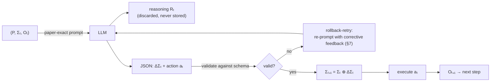

<div align="center">

# skillstate

**O(1) prompt-footprint runtime for long-horizon agent skills — structured execution state instead of append-only conversation history.**

[](./CONTRIBUTING.md)
[](https://www.npmjs.com/package/@skillstate/core)
[](https://www.npmjs.com/package/@skillstate/core)
[](./LICENSE)

</div>

---

Agent skills today run on an **append-only conversation history**: every step re-sends the entire transcript, so token cost grows quadratically — **O(T²)** cumulative for a T-step task. Long histories also *poison* the agent: stale hypotheses, dead ends, and raw tool spam crowd out the instructions, and accuracy degrades as the context fills.

`skillstate` implements the **SKILL.state** runtime from the paper [*SKILL.state: Scalable Long-Horizon Agent Skills*](https://arxiv.org/abs/2608.26263) (arXiv:2608.26263). Instead of replaying history, the agent maintains a compact, structured **execution state Σₜ** — a fixed-schema JSON object that is read once per step and patched between steps. The prompt footprint stays **O(1)** per step (a flat ~1.8k chars regardless of progress — Table 1 reports ~1800 characters, not tokens), cumulative cost drops to **O(T)**, and the agent always sees exactly what it knows.

## Results reported by the paper

| Metric | Conversation baseline | SKILL.state |
| --- | --- | --- |
| Cumulative prompt chars, Warehouse Gemini-3-Flash T=100 vs Stateful (1062387 vs 65408, §5.2) | O(T²) | **16.2× lower (paper-reported, not re-measured)** |
| Prompt size per step | grows with history | **flat ~1.8k chars (Table 1, not tokens)** |
| Worst baseline at max T: cumulative chars, T=200 Memory vs SKILL (6175509 vs 122384, Table 1) | O(T²) | **~50× (derived from Table 1 cells — worst baseline at max T, not a paper claim; "50x" appears nowhere in the text)** |
| pass@1, InterCode CTF benchmark | 43.2% | **54.2%** |

CTF/τ-Bench save only −60%/−40% — the large multiples come from the long-horizon Warehousing runs, not from every benchmark. Numbers are as reported in the paper, not re-measured by this implementation.

## Our measurements (reproducible, `npm run bench`)

Local deterministic harness (`packages/bench/src/harness.ts`): fixed 593-char
`formatPaper` turns, fixed 64-char observations, fixed mock-LLM replies —
no Gemini, no warehouse. Conversation baseline = prefix sums of our own
state prompts (the `TokenTracker.compareWithBaseline` model, paper §3.3
eq.5), so the reduction is exactly `(T+1)/2` — an optimistic upper bound,
not a deployment claim:

| T | state cumulative (chars) | conv cumulative (chars) | reduction (ours) | formula (T+1)/2 |
| --- | --- | --- | --- | --- |
| 10 | 5930 | 32615 | **5.5x** | 5.5 |
| 50 | 29650 | 756075 | **25.5x** | 25.5 |
| 100 | 59300 | 2994650 | **50.5x** | 50.5 |
| 200 | 118600 | 11919300 | **100.5x** | 100.5 |

State slope is 0 (flat 593 chars/step); conv slope grows linearly. Do NOT
confuse these with the paper rows above: e.g. our T=100 50.5x is
numerically close to the paper's T=200 ~50.46x by coincidence (different T,
different method — their §5.2 Stateful turns average only ~210 chars vs
their ~654-char SKILL step, hence 16.24x at T=100). Full method, tables,
and limitations: [`BENCHMARK.md`](./BENCHMARK.md); machine-readable
fixture: [`tests/bench/expected.json`](./tests/bench/expected.json).

> Fidelity notes (exact): "~1.8k chars Table 1 not tokens"; "16.2x Warehouse Gemini-3-Flash T=100 vs Stateful 1062387 vs 65408 §5.2 paper-reported not re-measured"; "~50x vs Memory at T=200 6175509 vs 122384 Table 1 — worst baseline at max T, not a paper claim; CTF/τ-Bench -60%/-40%"; "§5.7/§7 as simplified implementation, A.4 as byte-verbatim template, @non-paper/additive adapters with no host history trimming yield no saving."

### A state can be perfect for the wrong reason

One n=3 paper trial ended **30/30, total 1523** — the true sum, every §10.2 check
green, answer also 1523. Its transcript also contains:

```
execute: {"code": "return {total: 1466 + 57};"}   ->  { "total": 1523 }
```

The model could not sum thirty values from a bounded context. It summed them in
the host's JavaScript sandbox and wrote the answer into the state — after trying
bash twice, with `bc` not installed. On the same fixture:

| arm | schema | reads | other tools | sum-outsourced |
| --- | --- | --- | --- | --- |
| notes | — | 31 | 0 | **0** |
| paper | `done` + `total` | 46 | 13 | **3** |
| paper | `done` + `total` + `values` | 84 | 24 | **5** |

The control summed thirty values in its head and was right. The bounded context
is what made the numbers unreachable, and the model's answer was to reach outside
the mechanism for them.

So `state_ok` in this project means *"the state holds a number equal to the
truth"*, not *"the state accumulated the truth"*. §10.2's check 1 cannot ask
whether the model arrived there by the mechanism the state exists to carry.
`node scripts/census.mjs <transcript>` counts the attempts, no model required.

And the effect that dominates is neither. Four counters, same model, same 30
files:

| arm | reads | distinct | re-reads | patches | lag | erasure | sum-outsourced |
| --- | --- | --- | --- | --- | --- | --- | --- |
| notes | 31 | 30 | 1 (3%) | 0 | — | 0 | **0** |
| paper | 46 | 29 | 17 (37%) | 45 | 1 (2%) | 0 | 3 |
| paper | 37 | 29 | 8 (22%) | 43 | 2 (5%) | 0 | 3 |
| `values` | 87 | 30 | 57 (66%) | 112 | 4 (4%) | 1 | 6 |

A state can also be complete and numerically wrong. One n=3 trial ended
`{total: 1607, done: [all 30]}` against a truth of 1523, and the whole 84 is
`REAL_15`:

```
patch total=770  done=[cfg1..cfg15]   <- correct
patch {}
patch total=854  done=[cfg1..cfg15]   <- +84, and no new filename
```

`cfg15` was read and added; its **name was never recorded**, and nothing
re-derives a total from a list, so the error is permanent. At 19 files the model
wrote `cfg1..18 + cfg20` — `cfg19`'s value in the total, its name skipped — and
the next patch put `cfg19` in, moving the drift from +121 back to +84. A double
count cancelling a missed file by accident.

And the error is a **step function**, not a random walk. Replaying all 84 patches
of the 90-file run against the truth at each file count:

| files | 5 | 10 | 20 | 30 | 40 | 50 | 60 | 70 |
| --- | --- | --- | --- | --- | --- | --- | --- | --- |
| error | −65 | −65 | −65 | −65 | −65 | +27 | +21 | **+194** |

One mistake at the fifth file, held for **thirty-five consecutive steps** while
the model stayed self-consistent with its own wrong total — it never re-derives a
total from the list it also keeps, and nothing checks. −65 is exactly `REAL_4`: a
value in the total whose filename was not in `done`, the mirror image of the +84
above. So a run's total is as wrong as the sum of its discrete miscounts, and no
single one is visible in the final number.

§6.2 validates type, not value, and cannot do otherwise: checking 1523 needs the
fixture, and the fixture is what the state is being scored on. `state_ok` caught
this trial as a **failure** — the two verdicts are separate for a reason — but the
failure is the whole 84, and nothing in the mechanism points at which file.

**Lag is not the explanation, and I had it at 80% for a day because the counter
compared a read's basename against the relative path the model records** — so
`cfg1.ts` never matched `src/cfg1.ts` and every read looked unnamed. The real rate
is 2–5%.

So what does cause 37% of reads to be repeats? Not a state trailing the work — the
state names the file. The transcripts show the same two files going back and
forth: `cfg7, cfg7, cfg8, cfg7, cfg8, cfg7`, before it moves on. The model
re-reads a file it has already *recorded*, because it does not fully trust a
value it has already accumulated and the transcript is where it resolves the
doubt. Re-reads and the arithmetic drift are the same behaviour.

That is the structural half: §5.1 has the runtime choose the action and execute
it, one per step, so the model is never asked whether it believes its own state.
This host's plugin has no execute capability and the agent loop batches, so it is
asked every turn. Three prompt-level fixes have been tried and measured; all three
reached the model and all three were declined.

There is a structural reason this is the interesting failure, and it is a point
about §4.1 rather than about this model. An *absolute* value is idempotent —
`{total: 88}` then `{total: 139}` is a progressing record whether or not the
second patch is late. A *set* is not: `{done: [cfg1]}` after reading cfg1 and
cfg2 is stale the moment it lands, and nothing in §1–§10 reconciles a patch with
what the environment has actually done. §4.1 requires a set precisely because a
count is not well-defined without a conversation — which is the whole argument
for having a state. So the state that makes progress legible is the state that is
hardest to keep accurate, and the control arm has the same schema pressure and
none of the problem because it also has the transcript to check against.

§Limitations covers *"validation is loss-preserving, not semantic … it does not
verify that the content of a patch is a correct or desirable decision"*, which is
a patch that is **wrong**. It does not name a patch that is **well-formed and
stale**, and no amount of better validation reaches that one.

There is also a cost §3.3 does not price. The merge has **no append**: rule 1
overwrites, rule 2 deletes, rule 3 recurses only into plain objects, and the
contract closes with *"any non-object value (including arrays) is an atomic
replacement target"*. So a growing set is O(n) per step, and its failure is a
mistyped rewrite rather than a missed append. At 90 files it shows:

```
read  cfg11.ts
patch total=559  done=11       <- clean alternation
read  cfg12.ts
read  cfg12.ts                 <- a re-read inside one turn
patch total=629  done=1        <- the list collapsed from eleven to one
```

Twenty reads, twelve distinct, `done: 3/90`, base prompt 97% of a full Aₜ. A
patch carrying `{total: 629}` alone would have left `done` at eleven — sparse
means the merge leaves it alone. The model rewrote the field and got it wrong, and
the merge did exactly what it was told.

It rewrote it because **A.4 says `<dict: your state updates>` and does not say the
patch is sparse, nor that an array is replaced whole.** §3.1 knows both. Both are
now stated in P, which §4.1 makes the operator's specification and which the model
reads alongside A.4.

If you author a schema, the choice §4.1 does not warn you about is this:

| shape | cost per step | what breaks |
| --- | --- | --- |
| a set of filenames | O(n), rewritten whole | a mistyped rewrite at around ten entries |
| a cursor (`next: 12`) | O(1), two scalars | only correct for ordered work |

### What live runs showed that the conformance suite cannot test

The suite above pins the implementation to `state.md`. It cannot say what happens
when a model is handed that implementation, and the answers are not what you would
guess. Fourteen findings in [`FINDINGS.md`](./FINDINGS.md), each with the
observation, the paper clause that permits it, and what was done — a state erased
by a patch §6.2 accepts, a schema whose two views of one fact desynchronise
29-against-9, a complete state that is 84 too high because one file's name was
never recorded, a model narrating an order quoted back from its own past, and a
merge operator with no append. Plus the measurements that argue for the mechanism
and the two that bound it.

Read the preamble there before a number. **Six instruments in this project were
confidently wrong**, each in a different direction — a correctness column, an
erasure count, a lag rate, a drift counter, a liveness check, and a probe whose
output turned out to be the confound rather than the evidence. Each ran, each
printed, and none was compared against a second opinion. Corrections are kept in
place next to the findings they correct.

One of them is worth knowing about before you run anything here: **this host
resolves plugins by workspace, not by the name in `opencode.json`.** Asking for a
package that does not exist loads the one that does, and a copy of the plugin in
a project is silently ignored in favour of the repository's build. That is why
`scripts/ab-blind.sh` works — its symlink points into this repository — and it is
invisible, because a symlink to the repo and a resolution to the repo are the same
bytes. A measurement of this project can therefore be made with the wrong plugin
and look entirely healthy, which is why every run now records `plugin_live`.

**Every figure comes from a script that runs no model**, so the whole record is
checkable without a provider:

```
node scripts/census.mjs     <run>/out.json [...]   # re-reads, lag, erasure, outsourcing
node scripts/replay-at.mjs  <run>/out.json         # SUM |A_t| and eq. 8
node scripts/crossover.mjs <paper>/ <notes>/       # the ceiling on the host's overhead
```

The one measurement that argues *for* the mechanism, with every other variable
held fixed — same model, same fixture, one switch:

| arm | state | answer | wrote a state at all |
| --- | --- | --- | --- |
| paper — bounded context | 2/3 | 2/3 | **3/3** |
| notes — transcript in context | 1/3 | **3/3** | 1/3 |

Trial 1 is the shape worth looking at: the control computed 1523 and wrote
**nothing** — `done` empty, `total` 0, read from the state file rather than the
answer. With the transcript on screen there is no reason to keep a record.

But it is 1 of 3, not 3 of 3, and an earlier version of this file said "only one
has a state" on the strength of that one trial. What the three support is
narrower:

- every bounded trial wrote a state (3/3), so the mechanism is never inert;
- the transcript makes maintaining one **optional** rather than useless — 2 of 3
  control trials did it anyway, one of them building the `done` list in a
  JavaScript sandbox and writing it in;
- the paper arm is **not** more accurate: 2/3 against 3/3, control ahead on
  answers, both failing the same way — a value read and never written down.

So there is no accuracy claim here in either direction at n=3. What the trials
establish is the mechanism's purpose: the state is the only record there is when
the transcript is not, and the model uses it whenever it is the only record.

And the one that bounds it. Priced in §4.3's unit — raw string chars, not wall
tokens, which include the host's own per-call context — the paper arm sends
100,040 chars against the 2,300,920 a prefix-sum baseline would: **23.00×,
against a theoretical (T+1)/2 of 23.00**. Exact, and exact again at 90 files:
**31.00× against 31.00**, with the transcript tripled.

That is the length axis, and it is the one that decides the question:

| fixture | transcript | Σ\|Aₜ\| | eq. 8 | (T+1)/2 |
| --- | --- | --- | --- | --- |
| 30 files | 115k chars | 100,040 | 23.00x | 23.00 |
| 90 files | 338k chars | 155,672 | 31.00x | 31.00 |

Tripling the transcript grew the state's cost by 56%, against a baseline that
grows quadratically. On *content*, the saving improves with length. On wall tokens
it depends on the request count, because the host re-sends its own context once
per call:

| fixture | paper calls | control calls | H ceiling |
| --- | --- | --- | --- |
| 30 files | 59 | 31 | ~60,000 chars/call |
| 90 files | 60 | 31 | ~56,000 chars/call |

Nothing in §5.1 addresses request count, because §5.1 assumes the runtime owns
the loop, which is exactly what this host cannot give it.

**And then the length made the request count work for the mechanism instead of
against it.** At 90 files the control needed 192 tool calls and the bounded arm
128 — so the bounded arm now pays the host's overhead *less* often as well as
sending 46.9x less content, and the ceiling stops binding at all:

| | paper — bounded | notes — transcript |
| --- | --- | --- |
| tool calls | **128** | 192 |
| Σ\|Aₜ\| | 371,747 chars | — |
| control's prefix-sum context | — | 17,437,234 chars |
| eq. 8 | **65.50x** | — |
| state | 78/90, total 4314 | **90/90, total 4559** |
| answer | 3804 | **4559** |

**Read the bounded arm's row as a TRUNCATED run. Its transcript says so in its
last line.** 78/90, a total 245 low, the control all 90 — and the final events
are `read cfg79.ts`, `step_finish`, `step_start`, then:

```
{"type":"error","error":{"type":"unknown","message":"Transport: The socket
connection was closed unexpectedly. ..."}}
```

**It is the only run of the eight with an error in its transcript at all, and the
only one that ends on one.** So 78/90 measures nothing about the mechanism and
nothing about the model. I read it four times and got it wrong three times: as a
model losing track of its running sum, then as §10.1's step ceiling (130
*emitted* patches against a default of 100 *taken* steps is arithmetic about the
wrong quantity), then as a host transport failure — building an instrument to
prove the ceiling theory before opening the last line, where the answer had been
all along.

**The cause is this project's own harness.** Span the transcript's timestamps:

| run | wall clock |
| --- | --- |
| paper, 90 files, ceiling 100 | **39.9 min** |
| paper, 90 files, ceiling 200 | **39.9 min** |
| notes, 90 files | 6.9 min |

Not 39.8. Not 40.1. **39.9 twice, against the stand's own `timeout 2400`,** while
the control at the same length finished in 6.9. `timeout` sends SIGTERM, the host
closes the socket, and the last line reads "Transport: The socket connection was
closed unexpectedly." A harness decision wearing the costume of a network
failure — exit code 0, empty stderr, plausible state file.

The scorer now reads the run's own duration against the cap the stand records and
reports `at_timeout`. One subtraction, and it would have said this on the first
run.

**The step ceiling is untested, not refuted.** That run has no `.run.json` to
settle it. A six-file control takes 11 steps (1.83 per file) and this one reached
1.67 per file, which brackets §10.1's default of 100 at roughly 60 files of work
— which is why the retest runs with a raised ceiling.

**Two instruments were missing, and both were about the same thing: whether a run
finished at all.** §10.1's loop has three exits and one return value, and the third
(`range(maxSteps)` running out) is indistinguishable from completion; the host
adapter was worse, returning `null` for four different endings and having the
caller discard it. And the stand runs the model under `|| true`, so a dropped run
and a clean one leave the same files behind — empty stderr, plausible state, no
exit code. A run now reports which exit it took and the ceiling it ran under, in
`.skillstate/.run.json`; the scorer surfaces `stopped_by_ceiling` (three-valued —
absent is `null`, never `false`) and `ended_on_error` with the message.

**So "128 calls against 192" compares a finished run with a dropped one**, and a
cheaper unfinished run is not a saving — this project's own harness criterion: *a
cost win with no task completion is worth nothing.*

**What survives is the content, and it survives in the conservative direction** —
`SUM |Aₜ|` 371,747 against a control context of 17,437,234, eq. 8 at 65.50
against a theoretical 65.50 — because a run cut short sends less, never more. 78
files of patches cannot weigh more than 90 would.

**What does not survive is any accuracy claim, in either direction.** §1–§10 say
nothing about a model's ability to hold 78 filenames' worth of running sum with
no transcript to check it against, and this run is not evidence either way — a
socket closed at file 79. The question is open, not answered.

**No percentage is claimed** — a ratio built from these numbers would be a ratio
of two things the model never paid, and a test fails if a `%` appears in the
report.

## How it works


```mermaid
flowchart LR
    A["(P, Σₜ, Oₜ)"] -->|paper-exact prompt| B[LLM]
    B --> C["reasoning Rₜ<br/>(discarded, never stored)"]
    B --> D["JSON: ΔΣₜ + action aₜ"]
    D -->|validate against schema| E{valid?}
    E -- no --> F["rollback-retry:<br/>re-prompt with corrective feedback (§7)"]
    F --> B
    E -- yes --> G["Σₜ₊₁ = Σₜ ⊕ ΔΣₜ"]
    G --> H["execute aₜ"]
    H --> I["Oₜ₊₁ → next step"]
```

Each step:

1. Format the prompt `(P, Σₜ, Oₜ)` — procedural spec P, current state Σₜ, latest observation Oₜ. Nothing else.
2. The LLM returns free-text reasoning **Rₜ** followed by a fenced JSON block with exactly two keys: `state_patch` (ΔΣₜ) and `action` (aₜ).
3. **Rₜ is returned to the caller but never stored** — it cannot poison the next prompt.
4. ΔΣₜ is validated against the spec's schema. On failure, the runtime re-prompts with corrective feedback (the §7 rollback-retry cycle). After exhausting retries, the step fails deterministically: state is untouched, the sentinel action `__invalid_patch__` is reported.
5. On success the patch is merged: **Σₜ₊₁ = Σₜ ⊕ ΔΣₜ** — null values *delete* keys, nested objects merge recursively, the original state is never mutated (rollback is free).
6. The action is executed against the environment, producing Oₜ₊₁.

Two things this omits, because both are implementation decisions rather than
the paper's, and both change what the model sees:

- **What the runtime reports in Oₜ.** When a turn produced a patch but no tool
  call, the runtime asks again. The old implementation put the model's own last
  action there as an order; §2 forbids it, and the model obeyed the stored order
  rather than choosing — 54 `read` calls for thirty files where a control used
  one grep. Oₜ now carries a factual report ("step N ended; your state patch was
  applied; nothing was executed") and the model picks its own next action, which
  is the division the paper draws: `execute(aₜ, Σ_{t+1})` is the runtime's,
  choosing aₜ is the model's. `SKILLSTATE_CONTINUATION=1` restores the order.
- **Where corrective feedback lands.** §6.3 says it is "appended to the same
  bounded prompt", and the core runtime does exactly that. The opencode adapter
  prepends it to Oₜ instead, so A.4 stays byte-identical and the correction is
  still visible. Same prompt, different slot. Note this path rarely fires in
  practice: on a four-file task a model handles, not one of 46 prompts carried a
  correction.

## Installation

```bash
npm i @skillstate/core @skillstate/claude @skillstate/opencode @skillstate/codex @skillstate/mcp @skillstate/cli
```

Requires Node.js >= 20. TypeScript types are bundled with each package.
The repo is a set of independently published `@skillstate/*` packages — there is
no monolithic `skillstate` root package.

## Quick start

```ts
import { SkillStateRuntime, TokenTracker } from '@skillstate/core';
import { INTERCODE_CTF_SPEC } from '@skillstate/core/schemas';
import type { Observation } from '@skillstate/core';

const tracker = new TokenTracker({
  platform: 'generic',          // required: 'claude' | 'opencode' | 'generic'
  sessionName: 'ctf-run-1',
});

const runtime = new SkillStateRuntime({
  spec: INTERCODE_CTF_SPEC,     // canonical 5-field CTF spec (paper §3.1)
  llm: async (prompt) => {
    // Your LLM call. The prompt asks for reasoning + a fenced JSON block
    // with exactly two keys: state_patch and action.
    return callYourLLM(prompt);
  },
  execute: async (action, state): Promise<Observation> => {
    // Run the action (e.g. a bash command in a container) and return
    // what the agent observes next.
    const output = await runCommand(action);
    return {
      content: output,
      timestamp: Date.now(),
      source: 'bash',
    };
  },
  tracker,                      // optional; records per-step token metrics
  maxValidationRetries: 2,      // optional; default 2 (max attempts = 3)
});

// One Algorithm 1 step:
const step = await runtime.step({
  content: 'ls -la /',
  timestamp: Date.now(),
  source: 'bash',
});
console.log(step.action);            // the executed action
console.log(runtime.state);          // Σₜ₊₁ (read-only copy)
console.log(step.reasoning);         // returned to you, never stored in state

// Or run until done (default maxSteps: 100):
const results = await runtime.run(
  { content: 'Initial observation', timestamp: Date.now() },
  (r) => (r.newState.discovered_flags as string[]).length > 0,
);

// Metrics (§4.3):
console.log(tracker.getMetrics().averagePromptSize);  // flat — that's the point
console.log(tracker.compareWithBaseline().reductionFactor);
tracker.save('./skillstate-report.json');             // full JSON report
```

A plausible `llm` response looks like:

````text
I should check for hidden files in /home first.

```json
{
  "state_patch": {
    "working_dir": "/home",
    "active_files": [".bash_history"],
    "cmd_summary": "listed /home, found .bash_history",
    "tested_hypotheses": ["ls -la /"]
  },
  "action": "cat /home/.bash_history"
}
```
````

## Core concepts

| Concept | Symbol | What it is |
| --- | --- | --- |
| **ProceduralSpec** | `P` | Immutable skill definition: `id`, `name`, `instructions`, `schema`, `version`. The schema declares valid state keys, their types, and defaults. |
| **SkillState** | `Σₜ` | The mutable execution state — a plain JSON object whose keys are constrained by the schema. This is *all* the agent remembers between steps. |
| **Observation** | `Oₜ` | Latest environment observation: `{ content, timestamp, source? }`. |
| **StatePatch** | `ΔΣₜ` | The sparse update the LLM emits each step. Values overwrite; **`null` deletes a key**; nested objects merge recursively. |
| **⊕ merge** | `Σₜ₊₁ = Σₜ ⊕ ΔΣₜ` | Null-deletion merge (`StateManager.mergeState`). Never mutates the input state — merged states are fresh objects. |
| **Reasoning discard** | `Rₜ` | Everything before the JSON fence. Returned in `StepResult.reasoning` for debugging, but never persisted into Σₜ. |

Standalone state utilities are also exported: `StateManager.createInitialState`, `StateManager.mergeState`, `StateManager.validatePatch`, `StateManager.serializeState`, `StateManager.deserializeState` (plus a `createStateManager()` factory with the same functions).

## Platform integrations

The runtime ships first-class adapters for four agent hosts. Every adapter is
`@non-paper` — no adapters exist in arXiv 2608.26263v3.

| Host | Mechanism | State injection | O(1)? |
| --- | --- | --- | --- |
| **Claude Code** | project `.claude/settings.json` hook groups (`UserPromptSubmit` / `SessionStart(^compact$)` / `PostToolUse(^Bash$)`) + project hook scripts + stdio project `.mcp.json` + shared project `SKILL.md` | state injected per prompt, re-injected after compaction, persisted per Bash tool call (`additionalContext`) | additive — hooks cannot trim history, and compaction hooks cannot inject context |
| **OpenCode** | npm plugin (`"plugins": ["@skillstate/opencode"]` in the project config) with **native tools**, plus a shared project `SKILL.md` | `notes` (default): one additive, bounded fragment on `event.system`, transcript untouched. `paper` (opt-in): the A.4 context replacement, O(1) in transcript length | additive by default, and deliberately so (see [Why the transcript is never rewritten](#why-the-transcript-is-never-rewritten)); paper mode is opt-in and A.4-conformant |
| **Codex** | machine-level glue (`skillstate install`): `~/.codex/hooks.json` (`UserPromptSubmit` / `SessionStart(^compact$)` / `PostToolUse(^Bash$)`) + `.cjs` hook scripts + `[mcp_servers.skillstate]` TOML | state injected per prompt, re-injected after compaction, persisted per Bash tool call — project state is picked up automatically from the session cwd | additive via hooks; **programmatic O(1)** via `codex app-server` `thread/fork` trim (experimental) |
| **MCP** | stdio JSON-RPC server, protocol `2026-07-28` (`state.get` / `state.patch` / `state.validate` / `state.diff` / `state.checkpoint` / `state.rollback` / `state.summary` / `state.metrics` / `state.finalize` / `spec.get` / `spec.next` / `agent.list` / `agent.read` / `agent.merge`) | any MCP client accesses the runtime state as tools + `skillstate://` resources | n/a — runtime access, not prompting |

All project glue is committed and **inert until init**: a project without
`.skillstate/` state behaves like a vanilla host — the plugin injects no
system fragment and creates no files, hooks inject nothing and never create
state files, and the MCP tools return
`no skillstate state in this directory — run \`skillstate init\``.

## Multi-agent state (release 2.2.0)

2-3 parallel agents (hook sessions, sub-agents) used to share ONE
`<cwd>/.skillstate/skillstate.json` — last-writer-wins, patches
interleaved. Since 2.2.0 every agent gets an ISOLATED state copy plus a
cross-process lock on every write; the main agent folds sub-agent work
back explicitly:

- **Agent-scoped state.** A non-empty agent id scopes the state file under
  an isolated copy: `<cwd>/.skillstate/agents/<agentId>/skillstate.json`
  (the global bucket mirrors it: `~/.skillstate/global/agents/<id>/…`).
  Ids sanitize to `[A-Za-z0-9_-]`, ≤ 64 chars; the default (`''`) is the
  main agent with the plain path.
- **Where the agent id comes from.** Claude Code / Codex hook scripts take
  the 8-char prefix of the hook stdin's `session_id`; the OpenCode v2 plugin
  reads the `session.created` / `session.forked` parent edge off the server
  event stream (`data.parentID`) and scopes a sub-agent to
  `<parentPrefix>-<full session id>` — the full id, not a prefix, so two
  siblings sharing an 8-char prefix cannot collapse into one file; the MCP
  server reads `SKILLSTATE_AGENT_ID` from its env or accepts a per-call
  `{ agent }` argument (default `''` = main agent).
- **Cross-process locks.** `withStateLock(statePath, fn)` (async,
  `@skillstate/core`) serializes the MCP write hot path
  (`state.patch` / `state.rollback` / `state.checkpoint` / `agent.merge`);
  the self-contained hook scripts and the OpenCode plugin embed the sync
  `lockStateWrite(statePath, fs, fn)` (`O_EXCL` lockfile at
  `<state>.lock`, 10s stale-TTL takeover, 50ms × 40 retry loop). A race of
  two processes × 20 interleaved patches loses nothing.
- **Diff baseline on disk.** `state.diff` keeps its "since your last look"
  semantics through `<stateDir>/.diff-baseline.json` (atomic write, under
  the lock) — consistent across processes, no in-memory baseline divergence.
- **Agent tools (MCP).** `agent.list` scans `<stateDir>/agents/`
  (`{id, statePath, exists, summary, lastModified}`), `agent.read` shows a
  sub-agent's state read-only, and `agent.merge` folds a sub-agent copy
  into the main state (⊕ merge; conflicting scalars follow
  `keep: 'main' \| 'sub'`, default `'main'`; the sub copy is kept and
  marked `mergedAt`).

## Session lifecycle (release 2.3.0)

The state envelope belongs to the procedure (paper §3.2) — the agent's
data, nothing else. The session lifecycle is ORCHESTRATION metadata and
lives in a separate sidecar next to every state file:
`<stateDir>/.session-meta.json` (agent scopes keep their own:
`agents/<id>/.session-meta.json`), written with atomic temp-rename under
its own `withStateLock` (never the state lock):

```json
{
  "status": "running",
  "startedAt": "2026-09-05T09:00:00.000Z",
  "lastActivityAt": "2026-09-05T09:04:12.000Z",
  "agentId": "",
  "protocolVersion": "2026-07-28"
}
```

- **Statuses.** `running` — a live session (MCP `launch()` stamps it at
  start); `interrupted` — SIGINT/SIGTERM killed the server before the
  agent could finish; `completed` / `failed` — the agent called
  `state.finalize {status}` (its own "I am done" signal, optional
  free-text `result`); `merged` — the orchestrator folded the sub-agent
  copy into the main state (`agent.merge`).
- **Activity.** every MCP state write (`state.patch` / `state.rollback` /
  `state.checkpoint` / `agent.merge`) refreshes `lastActivityAt`,
  debounced to at most one sidecar write per 5 s.
- **Staleness.** `agent.list` and `state.summary` report
  `staleness: 'active' | 'stale' | 'orphan'`:
  `active` — running with fresh activity (or a terminal status, whose
  `status` field already says the outcome); `stale` — status `running`
  but no writes for 5 min (`STALE_MS` in `@skillstate/core` — the
  provider process died without a signal); `orphan` — no (or corrupt)
  sidecar next to the state file. `agent.list` entries add `ageMs` for
  running sessions, so the main agent tells "finished" from "died
  mid-run" at a glance.
- **Interrupt flush.** `launch()` wires the `installShutdown` seam from
  `@skillstate/core`: SIGINT/SIGTERM → flush `status: 'interrupted'` +
  re-pin the diff baseline to the surviving state → exit 130. Terminal
  statuses recorded by the agent itself are never clobbered (hosts
  SIGTERM their MCP servers after a clean finalize too). Pass
  `installInterruptHandler: false` when embedding the server into a
  process you own.
- **Interrupted note.** the Claude Code / Codex `SessionStart` hook
  scripts read the sidecar and, when the previous run was interrupted,
  append to the injected context: "Previous session was interrupted;
  state preserved at `<path>`; review progress/blockers before
  continuing." (`INTERRUPTED_SESSION_NOTE` in `@skillstate/core`). A new
  launch overwrites the status back to `running`.

### Claude Code

```ts
import { ClaudeAdapter } from '@skillstate/claude';

const adapter = new ClaudeAdapter();

// System-prompt boilerplate that turns any Claude Code session into
// state-based execution mode:
const modePrompt = adapter.generateAppendPrompt();

// Lifecycle hooks (self-contained CommonJS scripts, run via `node script.cjs`).
// Each resolves the per-project state from the session cwd at runtime and is
// INERT when the project has no skillstate state:
const inject = adapter.generateHookScript('user-prompt-submit');
// -> injects the current state into the prompt's additionalContext

const survive = adapter.generateHookScript('session-start-compact');
// -> re-injects the state right after compaction (matcher ^compact$)

const post = adapter.generateHookScript('post-tool-use');
// -> extracts state_patch from the Bash tool response, applies the
//    null-deletion merge, saves the state file (matcher ^Bash$)

// Merge the hook groups into the PROJECT .claude/settings.json ($CLAUDE_PROJECT_DIR-
// anchored commands; idempotent, env/permissions/model and foreign hooks preserved):
const merged = adapter.mergeHooksConfig(existingSettingsText, {
  scriptDir: '.claude/hooks/skillstate',
  commandFor: (event) => `node "$CLAUDE_PROJECT_DIR/.claude/hooks/skillstate/${event}.cjs" ${event}`,
});

// Also available: adapter.injectState(state, spec), adapter.formatPrompt(state, observation, spec),
// adapter.extractPatch(response), adapter.extractAction(response)
```

`skillstate init` writes the scripts and merges the hook groups for you —
everything under the project `.claude/` directory, committed with the repo.

### opencode

OpenCode **v2**. The host glue is the npm package itself: the project
`opencode.json` lists it under the v2 `plugins` key and OpenCode loads the
default export directly.

```jsonc
// opencode.json
{
  "$schema": "https://opencode.ai/config.json",
  "plugins": ["@skillstate/opencode"]
}
```

Only the plugin is registered. The plugin contributes **native tools** — typed
schemas and structured output, no JSON-RPC round-trip. The MCP server is still
shipped for every other MCP-capable host (claude, codex, and anything without
a plugin API); for opencode it was measured at ~1 600 tokens of resident tool
description per request and a second, disagreeing view of what may be written
to the same file. See the 3.0.1 changelog entry.

```ts
// What the plugin registers, in setup():
//   ctx.tool.transform(...)  -> skillstate_read, skillstate_update, skillstate_merge
//   ctx.session.hook('context', ...)  -> notes: additive; paper: replaces (opt-in)
//   ctx.event.subscribe(...)  -> session parent edges + the paper-mode state sink
```

Nothing else. It does not register `compaction`, `generate` or `title` hooks.

#### Two modes

The plugin holds one of two different contracts with the model. It is
`notes` unless a project asks otherwise, and it must stay that way: a default
that rewrites the context would reproduce the failure documented below.

| | `notes` (default) | `paper` (opt-in) |
|---|---|---|
| `event.messages` | untouched | replaced by one A.4 prompt |
| `event.system` | one bounded fragment | replaced (paper's P is the whole instruction surface) |
| Σₜ source | the `skillstate_*` tools | the `state_patch` the model emits, applied automatically |
| prompt size | grows with the transcript | constant — O(1) in transcript length |

Select paper mode with either:

```jsonc
// skillstate.json in the project root
{ "mode": "paper" }
```

```sh
SKILLSTATE_MODE=paper opencode   # environment wins over the file
```

An unrecognised value falls back to `notes` and is reported rather than
silently applied, so a typo cannot quietly select a mode nobody asked for.

**Paper mode is the paper's specification, not a tuning knob.** §3.2 discards
the reasoning trace by construction, so the model stops seeing its own
transcript; everything it needs to remember has to be in Σₜ. It is worth
choosing deliberately.

The paper-exact `OpenCodeAdapter` is still exported as the research surface
used by the benchmark. It is not the host integration, and nothing in the
plugin path calls it.

#### Why the transcript is never rewritten

The previous version of this integration rewrote the conversation on every
model request: it kept the system messages plus the last three non-system
messages, dropped everything else from `event.messages`, and appended a
synthetic `role: "user"` message carrying the state JSON.

Two independent failures in three lines:

1. Truncating to the last three messages **deleted the task statement, the
   tool results and the error messages** the agent had just been given. It
   was reasoning about work it could no longer see.
2. The injected message was appended **last**, as `role: "user"`. For a chat
   model the last user message is the current instruction, so a JSON blob of
   state displaced the user's actual request.

The old test suite asserted the bug — `expect(messages).toHaveLength(1 + 3 + 1)`.
It is replaced by `tests/opencode/context-integrity.test.ts`, which asserts
the opposite: every message of a 67-message conversation survives, the array
object is the same reference, and the only thing the plugin contributes goes
to `event.system`.

Four rules, each enforced by a test:

| Rule | Enforced by |
| --- | --- |
| `notes` mode never mutates `event.messages` | `context-integrity.test.ts` |
| Never inject behavioural instructions | `system-hint.test.ts` |
| Inert until a state file exists | `plugin.test.ts` |
| `paper` mode replaces the context with exactly Aₜ | `paper-mode.test.ts` |

#### Paper mode, and how Σₜ actually advances

A.4 ends the prompt with a directive: emit a `json` block containing
`{ "state_patch": { … }, "action": "…" }`. If nothing reads that block, Σₜ is
frozen and every later step re-reads a state that stopped moving — silent,
total failure on exactly the long-horizon work the paper targets.

The v2 session API has no response hook. `SessionHooks` offers `prompt`,
`context`, `compaction`, `generate`, `title`, the request/response HTTP hooks,
the WebSocket hooks and `retry` — all of which run before or around the model
call. None of them see the completed assistant text.

The server's durable event stream does. `session.text.ended` publishes one
finished assistant text block with `{ sessionID, assistantMessageID, ordinal,
text }`, on the same stream the plugin already subscribes to for the session
tree. `PaperStateSink` parses that text with the core's own
`PromptTransformer.parseResponse` — the same parser the benchmark measures, so
the A.4 prompt and the parse cannot drift apart — validates the patch against
P's schema (§3.2), and writes it through the project's normal locked atomic
write.

Four guarantees the sink makes, each with a test:

- **A rejected response never touches Σₜ** (§7). A missing fence, malformed
  JSON, a missing `state_patch`, a missing `action`, or a patch the schema
  rejects returns a typed outcome and changes nothing on disk.
- **At most once per block.** Durable events can be replayed after a
  reconnect; blocks are keyed by `assistantMessageID:ordinal` and remembered
  in a bounded set.
- **Failures are values.** Nothing throws into the event loop — a rejected
  sink would otherwise end the shared subscription and silently stop session
  scoping too.
- **Sub-agents keep their own scope.** The sink resolves the same scope as the
  registry, so a parallel sub-agent cannot clobber the root session's notes.

What the sink does **not** do is own the loop: the host's agent loop still
executes the action, so rollback-with-retry (§7) and opaque action dispatch
belong to `SkillStateRuntime` in `packages/bench`, not to a host plugin.

Measured on a live OpenCode 2.0.19, one session, five turns:

```
turn 1: messages= 3  hint=True  marker=True  override=False
turn 3: messages= 7  hint=True  marker=True  override=False
turn 5: messages=11  hint=True  marker=True  override=False
```

The transcript grows. Under the previous version it was pinned at 3.

### codex

```ts
import { CodexAdapter, CodexForkSession, resolveStateForCwd } from '@skillstate/codex';

const adapter = new CodexAdapter();

// Per-project state file for a cwd — <cwd>/.skillstate/skillstate.json
// (global bucket ~/.skillstate/global/skillstate.json when cwd === home):
const statePath = resolveStateForCwd(process.cwd());

// Codex hooks.json (three events): inject state on UserPromptSubmit,
// re-inject after compaction (SessionStart matcher ^compact$), persist
// state_patch from Bash outputs (PostToolUse matcher ^Bash$):
const hooksJson = adapter.generateHooksConfig(statePath, {
  scriptDir: '~/.codex/hooks/skillstate',
});

// Idempotent merge into an existing hooks.json (foreign hooks preserved):
const merged = adapter.mergeHooksConfig(existingHooksJson, {
  scriptDir: '/home/me/.codex/hooks/skillstate',
});

// Canonical hook-script path — generateHooksConfig and saveHookScript share
// this convention so the hooks.json commands and the on-disk .cjs scripts
// ALWAYS agree:
const script = adapter.codexHookScriptPath(
  '/home/me/.codex/hooks/skillstate',
  'post-tool-use',
); // -> /home/me/.codex/hooks/skillstate/post-tool-use.cjs

// Generate a self-contained .cjs hook script and persist it:
const scriptPath = await adapter.saveHookScript(
  'post-tool-use',
  '/home/me/.codex/hooks/skillstate/post-tool-use.cjs',
  statePath,
);
```

The hook scripts are self-contained CommonJS (Node builtins only) and resolve
the state from the session `cwd` — one machine-level `hooks.json` + one script
directory (installed once by `skillstate install`) serve every project, and
each script is inert when the project has no skillstate state. There is no
Codex SKILL.md: the bootstrap is the hook-injected state plus the skillstate
MCP tools. The `post-tool-use` script parses
`state_patch` from the `tool_response`: it accepts both fenced ```json
blocks and an unfenced JSON object, and is tolerant of wrappers such as
`Here is: {...}`. `user-prompt-submit` and `session-start-compact` inject
the current state as `additionalContext`.

**Honest limitation**: Codex hooks cannot trim host conversation history —
hooks alone give O(T) prompts. The programmatic O(1) path is
`CodexForkSession` (experimental, non-interactive runs): it drives
`codex app-server` over newline-delimited JSON-RPC (`thread/start`,
`turn/start` + `turn/completed`) and trims history via
`thread/fork { beforeTurnId }` / `thread/rollback`, so the forked thread's
prompt holds only instructions + state file + the newest turns.

```ts
const session = new CodexForkSession({ cwd: process.cwd() });
await session.start();
const step = await session.step('ls -la /');   // observation + state + turnId + threadId
await session.trim(1);                          // thread/fork → O(1) history
await session.close();
```

### MCP (Model Context Protocol)

```ts
import { McpAdapter, McpServer, launch } from '@skillstate/mcp';

const adapter = new McpAdapter();

// .mcp.json config registering the skillstate stdio server:
const config = adapter.generateMcpConfig('/path/to/.mcp.json');

// Or run an in-process server and drive it line-by-line:
// Without an explicit spec the server uses GENERIC_PROCEDURE_SPEC — a
// description of the storage format, never a task description.
const server = new McpServer({ root: '.', name: '.skillstate.json' });
const response = server.handleLine(
  JSON.stringify({
    jsonrpc: '2.0', id: 1, method: 'tools/call',
    params: { name: 'state.get', arguments: {} },
  }),
);
```

`launch(args)` reads `SKILLSTATE_SPEC_PATH` (or explicit args) and starts a
stdio server; state always resolves per session from the server's own cwd
(`<cwd>/.skillstate/skillstate.json`; the global bucket when cwd === home).
The `skillstate-mcp` bin launches it directly. Tools: `state.get`,
`state.patch` (validates; the single write op), `state.validate`,
`state.diff`, `state.checkpoint`, `state.rollback`, `state.summary`,
`state.metrics`, `state.finalize` (session "I am done" marker),
`spec.get`, `spec.next`. State is redacted on every read;
the transport is newline-delimited JSON-RPC (protocol `2026-07-28`).

### Integrate into your hosts

One command — detection, plugin, MCP registration, skill, and per-project
state are all handled automatically, for EVERY detected host at once:

```bash
npm i -g @skillstate/cli && skillstate init
```

`skillstate init [--spec <path>] [--dry-run]` detects the hosts from home-dir
markers (OpenCode, Claude Code, Codex) and writes ONLY project-local glue —
nothing lands in `~`:

- state envelope `./.skillstate/skillstate.json` + the procedure spec
  `./skill-spec.json` (from `--spec <path>` or the domain-neutral default);
- ONE host-neutral skill at `.claude/skills/skillstate/SKILL.md` — both
  OpenCode (project `.claude/skills/` discovery) and Claude Code read it;
- OpenCode: the v2 `"plugins": ["@skillstate/opencode"]` entry spliced into
  the project `opencode.json(c)` (comment-preserving, timestamped backup;
  the plugin is auto-installed by OpenCode via Bun). The MCP server is NOT
  registered there — the v2 plugin contributes native tools, and a second
  surface over one file with different write rules costs 1.6k tokens per
  request and makes "was this note saved?" depend on which tool the model
  picked. A config written by an earlier version is migrated: the legacy
  `plugin` array loses our entry, the key is dropped when nothing of yours is
  left in it, and a stale `mcp.skillstate` entry is removed;
- Claude Code: self-contained `.cjs` hook scripts in
  `.claude/hooks/skillstate/`, hook groups merged into the project
  `.claude/settings.json` with `node "$CLAUDE_PROJECT_DIR/.../<event>.cjs"
  <event>` commands (full path:
  `.claude/hooks/skillstate/<event>.cjs`), and the stdio server in the
  project `.mcp.json`;
- Codex: a hint only — `skillstate install` (machine-level, run once) wires
  `~/.codex` and picks up every project's state automatically;
- the v2 install manifest `.skillstate/install-manifest.json`, which
  re-init MERGES (adding a harness later = re-run `init`).

Idempotent: re-running never duplicates entries. `skillstate uninstall` rolls
exactly the manifest-recorded glue back; `skillstate uninstall --machine`
rolls the Codex machine glue back.

The installed skill is **domain-neutral** by default (a state-based execution
protocol — no task-specific assumptions). Bring your own procedure with
`skillstate init --spec ./my-task.json`.

#### What gets committed vs ignored

| Path | Git | Why |
| --- | --- | --- |
| `.claude/skills/skillstate/SKILL.md` | **committed** | host-neutral skill shared by OpenCode + Claude Code |
| `.claude/hooks/skillstate/*.cjs` | **committed** | self-contained Claude hook scripts (inert without state) |
| `.claude/settings.json` | **committed** | merged hook groups (`$CLAUDE_PROJECT_DIR`-anchored) |
| `opencode.json(c)` | **committed** | merged v2 `plugins` entry (native tools; no MCP entry for opencode) |
| `.mcp.json` | **committed** | merged `mcpServers.skillstate` stdio entry |
| `skill-spec.json` | **committed** | declarative task spec (instructions + schema) shared by the whole team; `init` never touches `.gitignore` |
| `.skillstate/` (state envelope, `install-manifest.json`, session sidecars, `agents/`) | **ignored** | per-session runtime state |
| `skillstate-report.json` | **ignored** | per-run report, overwritten on every `run` |

The only machine-level files live under your home directory, outside any git
repo: the Codex glue (`~/.codex/hooks/skillstate/`, `~/.codex/hooks.json`,
`~/.codex/config.toml`) installed once by `skillstate install`, and the
machine manifest `~/.skillstate/install-manifest.json`.

Manual step-by-step guides (tested on OpenCode 2.0.19):

- [`packages/opencode` → "Install into OpenCode (host)"](./packages/opencode/README.md#install-into-opencode-host) —
  add the npm plugin to the project `opencode.json(c)`, register the MCP
  server, share the project skill.
- [`packages/mcp` → "Registering the server"](./packages/mcp/README.md#registering-the-server) —
  add the `skillstate` stdio MCP server (`state.get` / `state.patch` / …);
  it resolves the state from the session cwd on its own.

Verify with `opencode debug config`, `opencode debug skill`, and an
`initialize` + `tools/list` round-trip against `packages/mcp/bin/mcp.js`.

## Real-world usage

### OpenCode — an additive system fragment by default

The npm plugin loads from the project `"plugins": ["@skillstate/opencode"]`
and registers three native tools plus one `context` hook:

```ts
import SkillStatePlugin from '@skillstate/opencode';

// What OpenCode calls: Plugin.define({ id, setup(ctx) }).
// setup registers, and returns the cleanup that aborts the event stream.
await SkillStatePlugin.setup(ctx);
```

- **`ctx.tool.transform(...)`** — `skillstate_read`, `skillstate_update`,
  `skillstate_merge`. Each has a JSON Schema, structured output, and a
  discriminated result (`{ ok: true, value }` / `{ ok: false, error }`), so
  a rejected patch comes back as a readable reason rather than a host-level
  tool error.
- **`ctx.session.hook('context', ...)`** — pushes ONE bounded fragment onto
  `event.system`. Nothing else. `event.messages` is never read for
  rewriting and never written. In `paper` mode this same hook replaces the
  context instead; see [Two modes](#two-modes).
- **`ctx.event.subscribe(...)`** — feeds the session registry, which is how
  a sub-agent is recognised and given its own state file, and (in paper mode
  only) the state sink that applies the model's `state_patch`.

The fragment is intentionally small and advisory. It names the state file,
renders the current notes (bounded — a large document is summarized to a key
list plus a pointer to `skillstate_read`), lists the tools, and says the
notes are a side channel rather than the task. It contains no "you must", no
"always", and no output format, because that framing is what turned a
persistence aid into a prompt override the first time round.

For a project that *has* a state file, the fragment says the state **is the
project's record** rather than an optional side channel, and — after
`DRIFT_NOTICE_AFTER_TURNS` model requests with no change — that the file has
not moved.

**Be clear about what that second half is worth.** The measurement that said "it
does nothing" was reading a counter with a blind spot, and the counter is now
fixed — so the honest statement is that the notice has never been measured
properly.

What was wrong: `turnsSinceWrite` and `stateWrites` reset only from the
paper-mode state sink, and the sink is `mode !== 'paper' ? undefined : new
PaperStateSink(...)`. **In notes mode there is no sink, so the counter never
moved.** The notice fired at its threshold and reported silence for runs in which
the model wrote the state on every step. Writes now reset it through the tool
path, in both modes, and a refused patch does not — because §6.4 guarantees Σ is
unchanged, so in that one case the state really has not moved.

What survives from the earlier runs: the model reaches the tool in ways the
notice was never built around — **from inside the host's `execute` sandbox**, as
`await tools.skillstate_update({patch: …})`, thirty-one times in one trial, so
there is not one direct call in that transcript. And at 30 files it writes state
in 1 of 3 trials, unprompted.

The notice is kept because it is honest and cheap. Whether it helps is now an open
question with a working instrument behind it, which is a different and better
position than the one it was in this morning.

Notes mode is therefore advisory, and honestly so. If you need the state to be
load-bearing rather than merely available, that is what [paper
mode](#two-modes) is for: it replaces the context with `(P, Σₜ, Oₜ)`, so the
runtime owns the step and a model that ignores the state has nothing to fall
back on.

State resolves from the plugin's own `ctx.location.project.canonical`, not
from `process.cwd()` — one OpenCode v2 server serves many projects, so the
process cwd is simply the wrong answer. The plugin is inert when the project
has no state file: no fragment, and no files created.

Compaction needs no special handling. `compaction` is a separate hook kind
in v2 and this plugin deliberately does not register it; the first
agent-loop request after a compaction re-adds the fragment.

### Claude Code — state-injection strategy (2.1.260)

History trimming from Claude Code hooks is **impossible**: the
compaction-time hook supports only `decision: "block"` (forbid compaction —
no context injection), and the post-compaction hook has no decision control
at all (its `systemMessage` is discarded). The adapter therefore implements
the **state-injection model**:

```ts
const adapter = new ClaudeAdapter();

// Injects the state into every turn (no matcher — fires on every prompt):
const inject = adapter.generateHookScript('user-prompt-submit');

// Matcher ^compact$: re-injects the state right after compaction —
// state survives the compressed history:
const survive = adapter.generateHookScript('session-start-compact');

// Matcher ^Bash$: extracts state_patch from the tool response, applies the
// ⊕ null-deletion merge, saves the state file:
const persist = adapter.generateHookScript('post-tool-use');

// Hooks section for the PROJECT .claude/settings.json, or merge it into a
// live settings.json (idempotent; env/permissions/model and foreign hooks
// preserved):
const hooksJson = adapter.generateHooksConfig('./.skillstate/skillstate.json', { scriptDir });
const merged = adapter.mergeHooksConfig(existingSettingsText, {
  scriptDir: '.claude/hooks/skillstate',
  commandFor: (event) => `node "$CLAUDE_PROJECT_DIR/.claude/hooks/skillstate/${event}.cjs" ${event}`,
});
```

`skillstate init` wires all of it project-locally: the `.cjs` scripts into
`.claude/hooks/skillstate/` (committed), the hook groups merged into the
project `.claude/settings.json` with `$CLAUDE_PROJECT_DIR`-anchored commands,
a stdio `skillstate` server in the project `.mcp.json` (`state.get` /
`state.patch` MCP tools), and one host-neutral
`.claude/skills/skillstate/SKILL.md` shared with OpenCode.

**Honest limitation**: prompts stay O(T) with a fresh state at every turn —
true O(1) requires host-side trimming, which Claude Code does not expose.

## Metrics

`TokenTracker` implements exactly the paper's §4.3 methodology — a clean **three-metric** primary object, measured in raw string chars (never tokenizer output, never a len/4 estimate):

```ts
const tracker = new TokenTracker({ platform: 'claude', sessionName: 'eval' });

// After steps have been recorded (automatically when passed to a runtime):
// §4.3 primary metrics — EXACTLY three fields.
const metrics = tracker.getMetrics();
metrics.averagePromptSize;     // Average Prompt Size (§4.3): mean prompt char length per call — flat, that's the point
metrics.totalTokens;           // Total Token Cost (§4.3): cumulative char burn (prompts + responses)
metrics.accuracy;              // Task Accuracy (§4.3): accepted patches / actionable
                               // steps; null when no step was actionable

// Session bookkeeping is kept SEPARATE so the §4.3 object stays clean:
const bookkeeping = tracker.getBookkeeping();
bookkeeping.stepCount;
bookkeeping.totalPromptChars;
bookkeeping.totalChars;        // same value as totalTokens (cumulative burn)
bookkeeping.sessionName;
bookkeeping.lastStepTimestamp;

const baseline = tracker.compareWithBaseline();  // Table 1 methodology on measured chars
baseline.conversationChars;   // Σₜ Σᵢ promptChars[i] — the O(T²) conversation model
baseline.stateChars;          // Σₜ promptChars[t] — the O(T) state model
baseline.reductionFactor;     // conversationChars / stateChars

tracker.exportReport();       // full JSON report (metrics + bookkeeping + steps + session)
tracker.save('./report.json');// persist; tracker.load() restores
```

The tracker models the conversation baseline exactly: at step *t* the transcript re-sends every prior turn, so cumulative conversation chars are `Σ(t=1..T) Σ(i=1..t) promptChars[i]`, while the state runtime sends only the current Σₜ each time. For constant-size prompts the closed form is `reductionFactor = (T+1)/2` (paper §3.3 eq.5–7).

Need a rough dollar figure or a tokenizer heuristic? Those are NOT paper metrics — use the explicitly-marked `@non-paper` helpers in `@skillstate/core` (`instrumentation`: `CharDiv4Counter`, `estimateCostSavings`) and label the result as estimated.

## Package exports

Each integration is an independently published package under the `@skillstate`
scope. There is **no** monolithic `skillstate` root package and no compat
re-exports — import exactly the package you need:

| Package | Contents |
| --- | --- |
| `@skillstate/core` | `SkillStateRuntime`, `TokenTracker`, `StateManager`, `PromptTransformer` (`formatPaper`), all types, plus the `@non-paper` additive helpers (`instrumentation`, `resilience`, `validate`, `redaction`, `atomic-write`, `state-store`, `migrations`, `events`, `logger`, `clock`, `provider`, `config`, `shutdown`). Subpath `@skillstate/core/schemas` exports `INTERCODE_CTF_SPEC`. |
| `@skillstate/claude` | `ClaudeAdapter` |
| `@skillstate/opencode` | `OpenCodeAdapter`, `SkillStatePlugin` (+ default export) |
| `@skillstate/codex` | `CodexAdapter` |
| `@skillstate/mcp` | `McpAdapter`, `McpServer`, `launch` |
| `@skillstate/cli` | `main`, `parseRunArgs`, `parseReportArgs`, `parseInitArgs`, `parseInstallArgs`, `parseUninstallArgs`, `loadCliConfig`, `loadCliSpec`, `loadResumeState`, `resolveInCwd`, `stubLlmResponse`, `CLI_USAGE`, host installers (`autoInstall` / `installMachine` / `uninstall`), dashboard helpers. Ships the `skillstate` bin (`init \| install \| uninstall \| run \| report`). |
| `@skillstate/bench` | deterministic benchmark harness (`npm run bench` in the repo) |

Every package exposes its root export path `@skillstate/<pkg>` (`.`).
`@skillstate/core` additionally exposes the schema subpath
`@skillstate/core/schemas`, and every package exposes its metadata via
`@skillstate/<pkg>/package.json`.

Bins: `@skillstate/cli` ships `skillstate`, `@skillstate/mcp` ships
`skillstate-mcp`.

## Paper fidelity

- [x] Algorithm 1 loop — prompt `(P, Σₜ, Oₜ)` → LLM → validate ΔΣₜ → merge ⊕ → execute aₜ. The model never receives previous observations, actions, or reasoning (§3); Rₜ is discarded permanently (§3.2)
- [x] ⊕ null-deletion merge (nested-object aware, non-mutating)
- [x] Appendix A.4 **byte-verbatim** paper prompt format (`PromptTransformer.formatPaper`) — the exact A.4 template (Instructions / `Skill Execution State` ```json compact [= `json.dumps(state, separators=(",",":"))`] / `Latest Observation` / blank-line-padded `Provide your response with:` → `1.` → `2.` two-key JSON fence), no schema description and no platform padding added; all other formatters (`formatForClaude`, `formatForOpenCode`, generic) are `@non-paper` adapter conveniences
- [x] §7 rollback-retry cycle with corrective feedback; deterministic fallback after retries — simplified (fixed retry count); malformed outputs never touch state per the Limitations paragraph
- [x] §5.7 failure-mode taxonomy is paper log analysis (68% Premature Overwrite/Deletion, 20% Schema/Type Coercion, 12% JSON Syntax on Gemma-4-31B T=100 logs) — NOT parser codes. Our parse-failure reasons (`no_block`, `malformed_json`, `missing_state_patch`, `missing_action`) are implementation-internal (`@non-paper`) and only feed the §7 retry feedback
- [x] O(1)/O(T) property test — prompt size stays constant modulo observation growth (`tests/core/runtime-footprint.test.ts`)
- [x] InterCode CTF canonical 5-field schema (`discovered_flags`, `tested_hypotheses`, `active_files`, `working_dir`, `cmd_summary`)
- [x] Exactly the §4.3 three-metric triad in chars — Task Accuracy (`accuracy`), Average Prompt Size (`averagePromptSize` = mean chars), Total Token Cost (`totalTokens` = cumulative burn) as the *clean* `getMetrics()`; session bookkeeping (`stepCount`, `totalPromptChars`, `totalChars`, `sessionName`, `lastStepTimestamp`) is separated onto `getBookkeeping()`; Table 1 ratios fixed as fixtures (`tests/core/paper-fidelity.test.ts`)
- [x] OpenCode v2 adapter (`@non-paper`): native tools via `ctx.tool.transform` (`skillstate_read`/`_update`/`_merge`, typed schemas, discriminated results) plus one additive, bounded `ctx.session.hook('context')` fragment; `event.messages` is never modified, and the invariant is asserted in `tests/opencode/context-integrity.test.ts`
- [x] Claude adapter: state injected on every `UserPromptSubmit`, re-injected after compaction (`SessionStart` matcher `^compact$`), persisted per Bash tool call (`PostToolUse` matcher `^Bash$`) via self-contained `.cjs` scripts merged into the project `.claude/settings.json`; stdio project `.mcp.json` + the shared project `SKILL.md` installed by `skillstate init`
- [x] Codex adapter (`@non-paper`): `hooks.json` (`UserPromptSubmit`/`SessionStart(^compact$)`/`PostToolUse(^Bash$)`) + self-contained `.cjs` hook scripts + `[mcp_servers.skillstate]` TOML, wired machine-level by `skillstate install` and picking up each project's state automatically; programmatic O(1) via `codex app-server` `thread/fork`/`thread/rollback` (experimental)
- [x] MCP adapter (`@non-paper`): stdio JSON-RPC 2.0 server (protocol `2026-07-28`, newline-delimited) exposing `state.get`/`state.patch` (validated single write op)/`state.validate`/`state.diff`/`state.checkpoint`/`state.rollback`/`state.summary`/`state.metrics`/`state.finalize`/`spec.get`/`spec.next`, plus `skillstate://state|spec|summary` resources and secret redaction
- [x] Session lifecycle (`@non-paper`): `<stateDir>/.session-meta.json` sidecar (statuses `running`/`interrupted`/`completed`/`failed`/`merged`, debounced `lastActivityAt`, `STALE_MS` staleness in `agent.list`/`state.summary`), `state.finalize` marker, SIGINT/SIGTERM interrupt flush via `installShutdown`, and the `SessionStart` interrupted-session note in the claude/codex hooks
- [ ] OpenCode limitation (deliberate): the v2 plugin does **not** trim the host transcript. Truncating it is what made the previous integration unusable — it deleted the task statement, the tool results and the errors the agent had just been given. The host conversation therefore stays O(T); the runtime's own prompt `(P, Σₜ, Oₜ)` remains O(1) per step, which is what the paper claims and what `tests/core/runtime-footprint.test.ts` asserts
- [ ] Claude Code limitation: hooks cannot trim history, and compaction-time hooks cannot inject context — state-injection keeps prompts O(T) with fresh state per turn; true O(1) requires host-side trimming
- [ ] Codex limitation: hooks cannot trim host history — hooks alone give O(T) prompts; programmatic O(1) requires the `codex app-server` fork-trim session (`thread/fork { beforeTurnId }`, experimental, non-interactive)

## Does the host integration actually save tokens?

**Measured for cost, and the task still fails. Read this section before
quoting any number from it.**

Two separate questions, and they have different answers.

### What the transcripts cost (measured, offline)

Over 1810 real runs in the host's own store — 118 days, 117 418 steps, no
model required:

| | |
| --- | --- |
| fresh input tokens | 3 507 364 525 |
| cache-read tokens | 16 119 115 415 (82.1% of prompts) |
| raw total | 19 626 479 940 |
| bounded Aₜ at 1 800 tokens/step | 211 352 400 |
| saving, cache reads priced at 1/10 | **95.9%** |
| runs where the transcript grew | 1582 / 1810 |
| runs where a bounded prompt costs more | **0 / 1810** |

The average step showed the model **29 900 prompt tokens**. A bounded A.4
prompt is 1 500–3 000. That ratio is the finding.

Two things this table is NOT. The 19.6B is not 19.6B tokens computed — 82% is
the prefix cache replayed at a tenth of the price, and adding it to `input` at
face value inflates the saving. And the 1 800 denominator is the paper's
Table 1 figure, not a measurement of ours; the numerator is real, the
denominator is an assumption.

Reproduce: `tests/bench/survey.test.ts` over
`tests/bench/_support/real-sessions.json`.

### Whether it still does the work (measured, and it does)

A real A/B on `opencode/big-pickle` — the weakest model in the catalogue —
7 trials per arm, identical task, through the harness's own gates
(`npm run bench:ab`, exit 0):

| | paper mode | notes (control) |
| --- | --- | --- |
| prompt tokens, median | 27 550 | 92 984 |
| spread (MAD) | **60 — ±0%** | 16 504 — ±18% |
| correct | 6 / 7 | 4 / 7 |

**70.4% fewer prompt tokens**, 4.0 MADs, every gate passed.

**This measurement was taken before the step driver worked, and that changes
what it is about.** `session.prompt` was being rejected by the host's own schema
on every call — `SchemaError: Expected string at ["text"]` — so `RuntimeDriver`
had never once driven a turn. The "paper mode" arm in this table had the bounded
context and *no step loop*, which is the configuration now behind
`SKILLSTATE_DRIVE=0`.

That is not a discredited number; it is a number about a different thing. On the
eight-file task that configuration gives 17 tool calls and a complete 8/8 state
at 319,366 tokens, and it is the cheapest paper configuration there. On the
thirty-file task it exits with **no answer at all**, at 101,616 tokens, with the
state at 1/30 — a run that ends on a turn that only narrated, because without a
driver nothing re-prompts.

So the 70.4% is a real measurement of context replacement without a step loop,
on a task short enough that the absence of the loop costs nothing. It is not a
measurement of the paper's mechanism, and it should not be read as one.

The spread column is the part that still holds: paper mode's per-run cost is flat
to within 60 tokens because the prompt does not grow, while the control swings
±18% as the transcript accumulates. That is confirmed independently at n=3 on the
thirty-file task, where paper's prompt per request is 12,239 – 12,710 across
three runs — a 1.04× spread.

On accuracy, do not over-read 6/7 vs 4/7 — it is suggestive and not
conclusive at this sample size, and both arms fail the *same* kind of step
(the model reads a file and does not write the fact). The claim that holds is
**cost at roughly equal accuracy**, not that paper mode is more accurate.

Reproduced on `opencode/mimo-v2.6-flash-free` and `opencode-go/space-bunny-free`
completing the same task. The integration is not model-specific.

**The bug that nearly buried this.** Every one of those runs failed first,
for a long time, and the symptom blamed the model: it would run a tool, get
the right answer, and never record it, which reads as a model refusing to
cooperate. A stronger model failed identically, which is what finally ruled
the model out. OpenCode v2 delivers a tool result as
`{ type: 'tool-result', result: { value } }` — the text is under
`result.value`, not `text` — and the reader only knew `{ type: 'text', text }`.
**Oₜ was empty on every turn.** Nothing threw and the state file looked
healthy. `SKILLSTATE_DEBUG_PROMPT=<path>` now dumps the roles, part types and
extracted observation per turn, so a `tool-result` sitting next to an empty
observation is visible on sight. Use `opencode run --standalone` for it: the
plugin lives in a background server, so environment variables set on the CLI
never reach it.

`SKILLSTATE_DEBUG_DRIFT=<path>` answers the other half — not what the host
sent, but what the model did about what we sent — appending
`{scope, turns, notice, writes}` per model request. It exists because "the
model ignored the notice" and "the notice was never built" look identical from
outside, which is exactly the ambiguity that sent the `tool-result` hunt after
the model for a long time.

`SKILLSTATE_DEBUG_STEPS=<path>` was added later, after a 30-file run answered
`1523` correctly with its state at 25/30. Twenty-five patches were emitted and
all twenty-five landed, so nothing was lost — which left three indistinguishable
stories: the loop stopped driving, the model abandoned the protocol, or the step
ceiling fired. The trace appends one line per turn with `{step, attempt, applied,
done, total, drove, note}` and settled it: the driver was live on every single
step, and the model had been narrating on 63% of them. `done` and `total` print
`-1` and `null` rather than `0` when the state has no such field, because a trace
reporting zero would be read as "the model did nothing" when the truth is "there
was nothing there to count".

Two switches exist so the cost trade-off is a measurement rather than an
argument:

| variable | default | what it changes |
| --- | --- | --- |
| `SKILLSTATE_MAX_STEPS=<n>` | 100 | the runtime-driven step ceiling, per §10.1's `Run(... maxSteps = 100)`. A malformed value is ignored rather than clamped, so a typo leaves the ceiling where the code says it is |
| `SKILLSTATE_DRIVE=0` | driving on | paper's context replacement with **no step loop**. Cheapest paper configuration on the eight-file task (17 calls, complete 8/8, 319,366 tokens) and **no answer at all** on the thirty-file task (101,616 tokens, state 1/30) — a run that ends on a turn that only narrated, because nothing re-prompts. Keep it for measurement; it is not a deployment option. |
| `SKILLSTATE_CONTINUATION=1` | off | put the model's previous action into Oₜ as an order. §2 forbids it — "the agent receives only Oₜ, never prior observations or actions" — and with it on the model obeys its own stored order instead of choosing: 54 reads for thirty files, one grep as a side errand. Exists so that cost stays measurable. |
| `SKILLSTATE_STEP_BOUNDARY=1` | off | withhold tools until the state has moved, which is §5.1's one-action-per-step enforced in code. It is off because the measured result is worse: a model given a turn with nothing to call answers in **prose** instead of a patch — *"the saved execution state is still {total:0, files:0} … I will restart from src/cfg1.ts"* — and the run stops at file one. Correct and tested; a claim to be measured, not a setting to leave flipped. |

Note the direction. Driving the loop is the paper's mechanism and is the
default: §5.1 line 12 has the runtime own execution. `SKILLSTATE_DRIVE=0` is the
deviation, kept because it is the configuration that batches, and the
difference between the two is the single largest cost effect measured here.

One thing a unit test cannot tell you, and which is worth knowing before you
trust any of the above: **does a mutation of `event.system` reach the model at
all?** The unit tests prove the plugin pushes onto the array; only a live run
proves the host reads it. It does — planting a marker in the state file and
asking the model to quote it back returns the marker verbatim. So when a
prompt-level addition measures as doing nothing, that is a result about the
model, not about a dead channel.

Two real prompt-layer bugs were found the same way and are fixed: the live
user instruction was rendered into A.4's observation slot, which the paper
reserves for the environment's reply, so a model treated the user's own
request as untrusted and refused it; and free-text state fields become a
competing instruction channel the model starts preferring over the user.

What remains unestablished is scale. The 70.4% figure comes from a three-turn
task with one fact handed over in the first message. A second task shape — eight
files, a constant hidden among decoys in each, a total not computable until the
last read — was built to break it, and it did, repeatedly. Every reason it broke
turned out to be a bug in this repository rather than a fact about the method:

- the runtime's step request was rejected by the host on every call, so it had
  never once driven a turn;
- the loop was triggered by `session.idle`, which the host does not emit;
- a turn was treated as a completed text block, so the next step was ordered
  while the current one was still running;
- a step was only a step if it produced a patch, which deleted the failure case
  §5.1 says to retry;
- one malformed event could end the event loop and silently kill the state sink.

With those fixed, a four-file accumulate task runs to completion: 11, 33, 66,
110, each patch exact, final state naming every file, answer correct. The
eight-file shape then runs 2/2 correct with a complete state.

**And then the sign of the result flipped, because the task was still too
short.** On eight files, paper mode cost 923,253 prompt tokens against the
control's 245,940 — 3.75× *dearer*, with every gate green on both sides. That is
not a refutation of the 70.4%; it is outside its range. A saving needs a growing
transcript to outrun a bounded prompt, and at 9–17 requests there is nothing to
outrun.

So the task was lengthened until one had something to outrun: 30 files of 40
lines, 1,200 lines of observation. The lever is observation size rather than file
count, because tiny files make a tiny transcript and would rig the comparison in
paper's favour by making the control's history too small to hurt.

| 30 files | paper, §5.1 retry | notes (control) |
| --- | --- | --- |
| prompt tokens | **1,607,539** | 2,015,473 (median, n=3) |
| uncached input | 149,801 | 241,061 – 1,502,583 |
| tool calls | 84 | 45 – 64 |
| state total 1523, 30/30 | ✓ | 3 / 3 |
| final state | **30/30** | 30/30, 30/30, 30/30 |

Before §5.1's retry loop, on the same fixture: answer correct, state **25/30**,
966,072 prompt tokens, 45 tool calls. Completeness was bought with steps — 84
calls against 45 and 68 — and that is the trade, stated rather than rounded off.

† A third paper run in the earlier n=3 set was killed by us to free the machine,
not by a fault. It is excluded rather than counted as a failure.

**These fixtures told the model the answer, so the answer column was void.** Each
task ended "output exactly TOTAL=1523"; the model printed it. The **state** was
the real evidence, and it was checked independently on every paper run — 30/30
with total 1523 — which is why the claim above is stated about the state. See
"the instrument that lied" below.

**These are provider token counts, not §4.3 metrics.** §8.2 requires the
comparison triple to be computed *in raw string characters*, so that any two
runtimes in any language can be compared without sharing a tokenizer; it says in
terms that dollar figures and tokenizer heuristics "must be labeled separately as
estimates — they are not §4.3 metrics and must not be presented as such." The
figures below are what the provider billed, read from the session database, and
they are labelled accordingly. A live two-arm comparison cannot easily produce
§4.3 chars, because the two arms are two separate model sessions rather than two
instances of one runtime; the core's `TokenTracker` measures the triad properly
and the conformance suite pins that it does.

**The n=3 result does not support a token saving on this task, and the
headline says so.**

| 30 files, n=3, every run reached 30/30 with total 1523 in the state | run 1 | run 2 | run 3 | median |
| --- | --- | --- | --- | --- |
| paper — prompt tokens | 2,211,504 | 1,211,662 | 1,613,699 | **1,613,699** |
| notes — prompt tokens | 96,827 | 148,160 | 1,780,955 | **148,160** |

Paper is **ten times more expensive at the median**. Against the control's best
run it is 12.5× more expensive than paper's own best. There is no slicing of
this data on which paper wins.

**Why the control is sometimes so cheap: it is a strategy, not a mechanism.**
Two of the three notes runs read one file and then ran **one grep** across
`src/` for the `REAL_` constants — 6 and 9 tool calls — and both declared the
deviation in their own output: *"I did not read the files one at a time, and I
emitted one consolidated state patch instead of 30."* The third read all thirty
one at a time, 65 calls, 1,780,955 tokens, costing roughly what paper cost. The
control's cost is what the model chose to spend, and it chose a cheaper way two
times out of three.

**What survives is a bound, not a saving.**

| uncached input per request | range | spread |
| --- | --- | --- |
| paper | 121,609 – 130,133 | **1.07×** |
| notes | 36,413 – 1,240,321 | **34.06×** |

Paper's per-step cost is genuinely bounded; the control's varies by a factor of
34 on the same task. That is the paper's shape, and it is a claim about
**dispersion**. It is not a claim about cost, and the two must not be swapped —
the control's best case beats paper's worst by an order of magnitude.

**Three earlier figures in this file are withdrawn.** They reported 2.09×, then
1.25×, then 8.96× on uncached input. All three were real arithmetic on real
numbers, and all three were computed against a control that happened to read
file-by-file that day. The 2.09× also compared an incomplete run against a
complete one. None survived n=3. The pattern across the three is worth more than
any of them: a saving figure quoted before the replicate is a hypothesis.

The 70.4% figure earlier in this file stands for its own three-turn task and is
unmeasured beyond it. It is not evidence about this one.

Scaling from 8 files to 30 is a 3.75× larger task: paper went **+5%**, the
control **+735%**. The two numbers locate it — the control's
uncached input is 16.6× paper's, because a growing history is re-sent every
request, while paper's context is stable and therefore cache-local. Paper's
`cache_read` is the *higher* of the two: a bounded context that repeats gets
cached, a history that keeps changing does not. The saving is cache locality,
not less text.

**The spread corrects an earlier claim of ours.** The three-turn table above
reports paper's spread as flat to within 60 tokens against the control's ±18%,
and calls that the mechanism visible in one number. On the thirty-file task
that inverts: paper's relative MAD is 38%, the control's 1.8%. The flatness was
a property of that short task, not of paper mode. The narrower truth: paper's
cost is bounded *per step* while its step count varies (45, 68 and 31 tool
calls), so the total is less predictable; the control's grows with its
transcript while its run length is steadier. Paper wins on the total and loses
on the predictability, and both hold at once.

§5.1's bounded retry — `k + 1` attempts at the same `Aₜ`, each after the first
carrying the reason the last failed — was not implemented, and it was the cause.
Without it each failed attempt became its own step, so the corrective feedback
arrived on a different `Aₜ` than the one it was correcting, and the model spent
about 63% of turns narrating instead of patching. Implemented, the state reaches
30/30 under the step ceiling (§10.1's 100). §6.4's synthetic observation now
accompanies a spent step, so the model is told the step ended and the state was
not written.

One hazard remains and belongs to the paper rather than to this implementation:
§3 rule 1 replaces arrays wholesale, so a model emitting `done: ["cfg9.ts"]` over
a ten-element list is doing exactly what is specified. Observed once — the state
rewound, `total` double-counted, and the run still answered correctly out of its
own arithmetic. A guard against that would be a rule the paper does not have, so
it is described here rather than added.

What is still open is the same thing it was before, one scale further along:
the crossover is bracketed between 8 and 30 files, not located, and the state
completeness gap at the crossover is unaddressed. The paper's own §7 also notes
that a bounded prompt does not help when the task is defined over the historical
trajectory, and nothing here measures a long autonomous run.

## Development

```bash
npm ci
npm test                # the full suite; coverage thresholds are enforced below
npm run test:coverage   # 100% thresholds enforced (branches/functions/lines/statements)
npm run typecheck       # tsc -b
npm run build           # tsc -b — emits each packages/*/dist/
```

The library is developed test-first: every behavior lands with a failing test before its implementation (see [CONTRIBUTING.md](./CONTRIBUTING.md)).

## Citation

If you use skillstate, please cite the paper:

```bibtex
@article{badhe2026skillstate,
  title   = {SKILL.state: Scalable Long-Horizon Agent Skills},
  author  = {Badhe, Sanket and Tiwari, Priyanka and Chung, Jonghyun},
  journal = {arXiv preprint arXiv:2608.26263},
  year    = {2026},
  url     = {https://arxiv.org/abs/2608.26263}
}
```

## License

[MIT](./LICENSE) © 2026 Vitaly Kuzyaev
